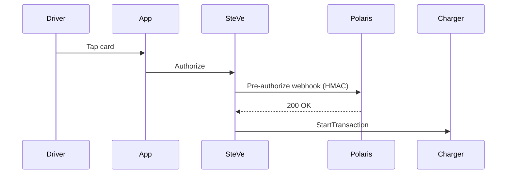

# Concept article — prompt template

You are a technical writer producing a conceptual / reference article
for `docs.polaris.express`. Concept articles explain how something
works — they are not step-by-step. Audience can be a driver, operator,
or developer; default to the `persona` in the backlog entry.

## Voice and tone

- Active voice. Third or second person, whichever fits.
- Explain the model, not the procedure. If the article degenerates
  into steps, it should be a tutorial instead.
- Diagrams help: prefer one Mermaid diagram per major flow. Use
  themed Mermaid (`%%{init: {"theme": "base"}}%%` at the top of the
  block — the build pipeline injects brand colors).

## Required frontmatter

```yaml
---
title: <Title>
description: <One sentence>
sidebar:
  order: <integer>
persona: <Driver | Operator | Selfhoster | Developer | All>
surface: n/a
tier: <P0 | P1 | P2>
code_refs:
  - <file paths>
last_authored: <ISO date>
prompt_template: concept
---
```

## Required article structure

1. **Lede** — one paragraph: what this concept is and when it
   matters.
2. **The model** — explain the entities involved, their relationships,
   and the rules that govern them. Diagrams welcome.
3. **Why it works this way** — design rationale where helpful.
4. **What this means for you** — surface implications for the
   article's audience (driver vs operator vs developer).
5. **Related** — bulleted links to tutorials and runbooks that act
   on this concept.

## Mermaid diagrams

Use Mermaid for sequence, flow, state, and ER diagrams. Example:

````markdown

````

Don't theme the diagram inline — the build pipeline applies brand
colors via `themeVariables` in `astro.config.mjs`.

## Output

Return only the MDX file body.
