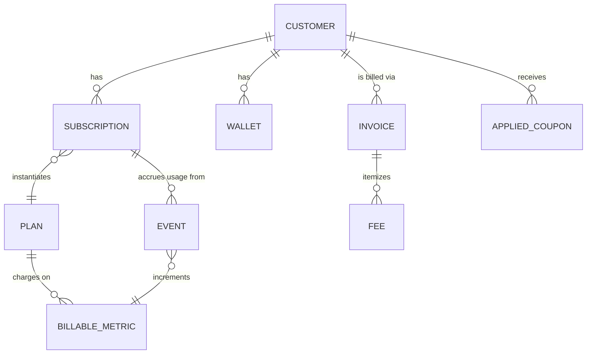
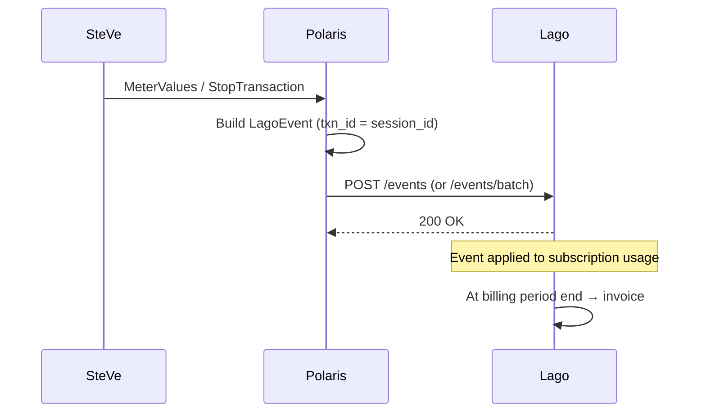

import Glossary from "@components/Glossary.astro";

Polaris Express does not run its own billing engine. Every customer,
subscription, plan, coupon, wallet, and invoice you see in the admin UI
is a thin projection of state held in [<Glossary term="<Glossary term="Lago">Lago</Glossary>">Lago</Glossary>](/glossary#lago) — an
open-source billing platform we deploy alongside the rest of the stack.
Understanding that boundary is the difference between fixing a billing
issue in five minutes and chasing ghosts in our database.

## The model

There are four core entities to keep in your head. Everything else in the
billing surface is built on top of them.

### Customers

A [<Glossary term="<Glossary term="Lago customer">Lago customer</Glossary>">Lago customer</Glossary>](/glossary#lago-customer) is the billing identity for
one Polaris account. We address customers by their `external_id`, which
is always the Polaris user's [<Glossary term="<Glossary term="Public ID">Public ID</Glossary>">Public ID</Glossary>](/glossary#public-id) — never
Lago's internal `lago_id`. This means we can recreate the Lago side
deterministically if the billing database is ever rebuilt: the same
Polaris user always maps to the same Lago customer.

Customer create and update both POST to `/customers` — Lago treats it
as upsert-by-`external_id`. The two methods in `lago-client.ts` exist
only to signal intent at the call site.

### Plans and subscriptions

A **plan** is the price sheet: a base fee, a currency, and a list of
*charges*, each pointing at a [<Glossary term="<Glossary term="Lago metric">Lago metric</Glossary>">Lago metric</Glossary>](/glossary#lago-metric) with
a pricing model (flat, package, tiered, volume). Plans are managed in
the Lago admin UI, not in Polaris — we read them but never write them.

A [<Glossary term="<Glossary term="Lago subscription">Lago subscription</Glossary>">Lago subscription</Glossary>](/glossary#lago-subscription) attaches one customer
to one plan. Subscriptions, like customers, are keyed by an external ID
we control. A single customer can hold several subscriptions
simultaneously (e.g. a base plan plus a top-up).

Subscriptions also carry a `metadata` bag, which Polaris uses to mirror
the active [charging profile](/glossary#charging-profile) onto the
subscription. This is why `getSubscription` returns a
metadata-tolerant schema while `getSubscriptions` (the list endpoint)
does not — only callers that need the mirror pay the schema cost.

### Events

Usage is reported as **events**. Every event has:

- a `transaction_id` (idempotency key — Lago dedupes on it),
- an `external_subscription_id` (which subscription to bill),
- a `code` (the metric to increment),
- a `properties` bag (typically `{ value: <kWh> }` for sum-aggregated
  metrics).

Events are append-only. Once Lago has accepted an event with a given
`transaction_id`, sending it again is a no-op. This is the property
that lets us retry safely after a network blip.

### Invoices

Invoices are produced by Lago at the end of each billing period, or
on-demand for one-off line items. They flow through these states:
`draft` → `finalized` → `paid` / `voided`. Polaris exposes the verbs
that move an invoice between states (`finalize`, `void`, `refresh`,
`retry_payment`, `download`), but the state machine itself lives in
Lago.

PDF generation is asynchronous: `downloadInvoicePdf` enqueues the job
and returns immediately. The `file_url` populates later, so the UI
polls `getInvoice` until it appears.

## Why it works this way

**Lago owns the truth.** We considered caching subscriptions and
invoices in Polaris's database, but every cache we sketched had the
same failure mode: it would drift, and the drift would silently
misbill someone. Treating Lago as the source of truth — and re-fetching
on every render — keeps the blast radius of a Polaris bug small.
Polaris bugs cause UI glitches; they don't cause invoices to be wrong.

**External IDs are ours.** Lago's internal `lago_id`s are opaque UUIDs
that change if the Lago instance is ever rebuilt. By keying every
relationship by IDs we generate ([Public ID](/glossary#public-id) for
customers, session ID for events), we make the integration
reproducible and debuggable. If a customer asks "why was I charged
3.2 kWh for session X?", we can search Lago for `transaction_id = X`
and get a one-row answer.

**Idempotency on the wire.** The `transaction_id` field is not
optional — even our batch event creator forwards it untouched. This
means retry logic at every layer (the `retry` wrapper in
`lago-client.ts`, the sync queue, the operator clicking "resync") is
safe by construction.

**Schemas at the boundary.** Every Lago response is parsed through a
Zod schema before returning to callers. If Lago changes a field type
in a minor version, the failure surfaces immediately at the boundary —
not five layers up in a React component.

## What this means for you

As an operator working with billing:

- **Don't try to "fix" billing data in Polaris's database.** Polaris
  has no billing tables to fix. Open the Lago admin UI (or use the
  Lago API) for any correction that needs to persist.
- **The Polaris admin UI is a window, not a workspace.** Buttons like
  "Void invoice" or "Apply coupon" round-trip to Lago. If Lago is down,
  these buttons fail loudly — they do not queue.
- **Event replay is safe.** If you suspect events were lost (e.g. Lago
  was unreachable for a period), you can re-run the relevant
  [sync run](/glossary#sync-run). Events that already landed are deduped
  by `transaction_id`.
- **Plan changes happen in Lago.** Polaris never edits plan pricing.
  If you need a new tier, create it in the Lago admin UI and Polaris
  will pick it up on its next plan list refresh.
- **Customer self-service is iframed.** When a customer hits the
  billing portal, we fetch a signed `portal_url` from Lago and render
  it in an iframe. We never proxy that traffic.

## Related

- [Reconciling Polaris users with Lago customers](/admin/billing/user-mapping/)
- [Replaying lost usage events](/runbooks/lago-event-replay/)
- [Issuing a one-off invoice](/admin/billing/one-off-invoice/)
- [Webhook signature verification](/concepts/lago-webhooks/)
- [<Glossary term="<Glossary term="Charging profile">Charging profile</Glossary>">Charging profile</Glossary> metadata mirror](/concepts/charging-profile-mirror/)