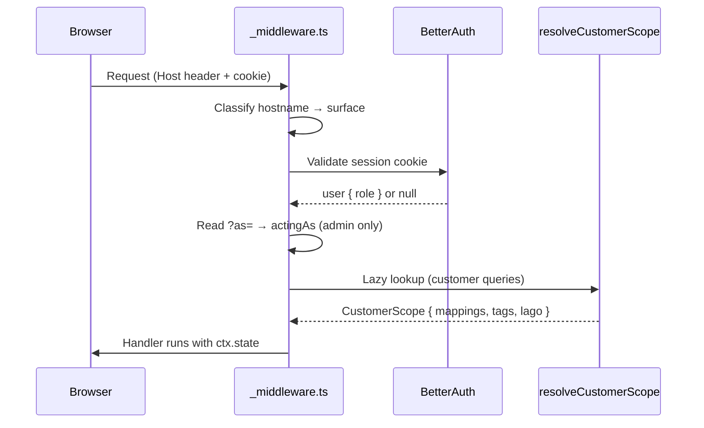

import Glossary from "@components/Glossary.astro";

Polaris Express runs two distinct UI surfaces — the operator console
at `manage.example.com` and the customer portal at `example.com` —
from a single Fresh application backed by a single user database.
Permissions in the app are not just "who is signed in"; they are the
product of **which hostname served the request**, **what role the user
holds**, and **whether an admin is currently impersonating a customer**.
Understanding that triple is the key to predicting what any given
session can see or do.

## The model

Three pieces of state, set in order on every request, determine
authorization:



### Surface (hostname → behavior)

The middleware classifies the request hostname into a `Surface`:

- `manage.example.com` → `admin`. The file-system path is rewritten
  to prepend `/admin` before Fresh dispatches, so a route at
  `routes/admin/chargers/index.tsx` answers `manage.example.com/chargers`.
- `example.com` → `customer`. No path rewrite; routes serve directly.

`ctx.state.surface` is set on every request. Layouts, navigation,
theme defaults, and capability checks branch on this value rather
than re-parsing the hostname.

### Role (who the user is)

Every row in `users` carries a `role` of either `admin` or `customer`.
Role is declared as an additional <Glossary term="BetterAuth">BetterAuth</Glossary> field so it survives the
adapter's input-stripping. Three independent code paths set it, and
all three converge on the same defense-in-depth rule: **the surface
that signed you up decides your role.**

| Sign-in path                 | Surface  | Forced role |
| ---------------------------- | -------- | ----------- |
| Email + password             | Admin    | (existing)  |
| Pocket ID OIDC callback      | Admin    | `admin`     |
| <Glossary term="Magic link">Magic link</Glossary>                   | Customer | `customer`  |
| Seed script / admin endpoint | Admin    | `admin`     |

The `databaseHooks.user.create.before` hook re-stamps role based on
the BetterAuth path (`/sign-in/magic-link` vs `/oauth2/callback/*`),
so even a future signup flow cannot cross-contaminate.

### Customer scope (what data a customer owns)

For customer-surface requests, the middleware lazily resolves a
`CustomerScope` and memoizes it on `ctx.state.customerScope`:

```ts
interface CustomerScope {
  lagoCustomerExternalId: string | null;
  ocppTagPks: number[];
  mappingIds: number[];
  isActive: boolean;
}
```

Every Drizzle query that reads customer-owned data pre-filters on
one of these arrays. `isActive` is `false` when every owned mapping
is soft-unlinked — capability checks for start, stop, and reserve
read this flag to gate the action without deleting the historical
mappings.

### <Glossary term="Impersonation">Impersonation</Glossary> (`?as=<userId>`)

An admin browsing the customer surface can append `?as=<customerUserId>`
to view the portal as that customer. The middleware sets
`ctx.state.actingAs`, and ownership-scoping helpers read
`actingAs ?? user.id`. **Mutating endpoints must reject when
`actingAs` is set** — impersonation is read-only in the MVP. This
is enforced per-handler, not centrally; treat any new POST/PATCH/DELETE
on the customer surface as needing an explicit `actingAs` check.

### Cross-subdomain sessions

Cookies are scoped to `.example.com` with `crossSubDomainCookies`
enabled. The same session cookie is valid on both hosts, which is what
makes impersonation work without a re-login. The `multiSession` plugin
additionally lets a single browser hold parallel sessions (up to five)
so a staffer can be signed in as their admin self on `manage.` and
their personal customer account on the apex host simultaneously.

## Why it works this way

**Host-based surface dispatch over role-based routing.** Splitting by
hostname means the customer portal cannot accidentally render an admin
route — the route doesn't exist on that surface. URL leaks, bookmark
sharing, and SSRF reconnaissance all fail closed because the path
itself is invalid on the wrong host.

**Role re-stamped at the auth-path boundary.** BetterAuth's adapter
historically dropped unknown fields, which silently mis-classified
Pocket ID admins as customers. Declaring `role` as an additional field
fixes the create path; the `before` hook is belt-and-braces for any
future signup route.

**Customer scope memoized, not re-derived.** A typical customer page
runs three to five queries that all need the same mapping/tag lists.
Resolving once per request and caching on `ctx.state` keeps the page
fast and guarantees consistency — every query in the request sees the
same snapshot of mappings.

**Impersonation as a URL parameter, not a session swap.** The admin's
identity remains in the session cookie; `?as=` only changes the
ownership filter. Audit logs continue to record the admin's real
`user.id`, and one accidental tab close ends the impersonation.

## What this means for you

As an operator, the practical consequences:

- **Admin accounts are provisioned, not self-served.** Email/password
  admins come from the seed script or the admin user-management
  endpoints. Pocket ID admins are gated by your OIDC group membership
  — the OIDC mapper rejects unlisted users before user creation.
- **Customers self-serve via magic link, gated by tag linking.** The
  magic-link plugin runs with `disableSignUp: true`, so a magic-link
  request for an unknown email returns success-shaped output but
  creates no account. New customers are auto-provisioned when you link
  an <Glossary term="idTag"><Glossary term="OCPP">OCPP</Glossary> tag</Glossary> to their email on the admin side.
- **Impersonation is for support, not for action.** Use `?as=` to
  reproduce what a customer sees. If you need to start, stop, or refund
  on their behalf, do it from the admin surface against their record —
  not from the impersonated session.
- **Soft-unlinking a customer disables capabilities but preserves
  history.** Setting every mapping to `is_active=false` flips
  `CustomerScope.isActive` to false, which blocks start/stop/reserve
  while keeping their transaction records intact and queryable.
- **Sessions follow the cookie domain.** If you change `COOKIE_DOMAIN`
  or move a surface to a new hostname, existing sessions will not
  carry over and the multi-session plugin will not bridge them.

## Related

- [Add an admin user](/admin/runbooks/add-admin-user/) — how to
  provision an admin account via seed or endpoint.
- [Link a customer to their OCPP tag](/admin/tutorials/link-customer-tag/)
  — the flow that creates a customer account.
- [Configure Pocket ID OIDC for admins](/admin/runbooks/configure-pocket-id/)
  — group-gated admin sign-in.
- [<Glossary term="Audit log">Audit log</Glossary> reference](/admin/reference/audit-log/) — what's recorded
  for sign-ins, magic-link requests, and impersonation.