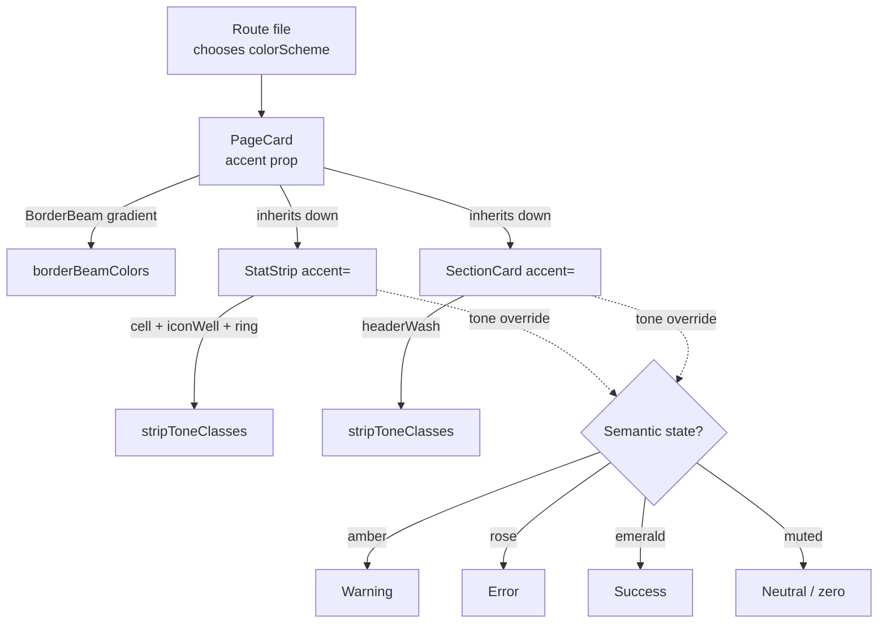

The admin UI uses a single, enumerated palette of accent colors — eighteen hues
plus a `muted` neutral — to give every page a coherent identity. The accent
color system is the contract between that palette and the components that
consume it: `PageCard`, `StatStrip`, `SectionCard`, sidebar items, modals, and
the `BorderBeam` animation. If you're building or refactoring an admin route,
this is the model you're working inside.

## The model

There are three layers: the **palette**, the **tone tables**, and the
**propagation rule**.

### Palette

`AccentColor` is a const-tuple union of eighteen Tailwind hues, defined in
`src/lib/colors.ts`:

```
red, orange, amber, yellow, lime, green, emerald, teal, cyan,
sky, blue, indigo, violet, purple, fuchsia, pink, rose, slate
```

`StripTone` extends this with `muted` for neutral/inactive cells. Every other
color decision in the admin UI resolves back to one of these nineteen tokens.

### Tone tables

For each accent, three static lookup tables provide pre-baked Tailwind class
strings and OKLCH values:

| Table | Used by | Provides |
| --- | --- | --- |
| `borderBeamColors` | `BorderBeam` animation | `{ from, to }` OKLCH gradient stops |
| `accentTailwindClasses` | Buttons, toggles, tooltips, sidebar items | `bg`, `bgHover`, `text`, `tooltip`, `toggleOn` |
| `stripToneClasses` | `StatStrip` cells, `SectionCard` headers | `cell`, `hoverBorder`, `ring`, `iconWell`, `headerWash` |

These tables are **enumerated statically** — one entry per accent, every class
string spelled out in full. That's a deliberate constraint, not a verbosity
problem (see "Why it works this way" below).

### Propagation rule



The rule is: **one accent per page**. A route picks a `colorScheme` and passes
it to its `PageCard`. That same value cascades to every `StatStrip` and
`SectionCard` on the page. Individual `StatStripItem`s or `SectionCard`s may
override their tone, but only for **semantic** reasons — never for visual
variety.

### Semantic tone overrides

The four reserved overrides form a small, fixed vocabulary:

- `amber` — warning (overdue items, offline-when-nonzero counts)
- `rose` — error (failed jobs, deactivated entities)
- `emerald` — success (paid, activated, healthy)
- `muted` — neutral / inactive / zero-valued

A page styled `blue` that has an "Errors" stat tile renders that one tile in
`rose`. Every other tile stays `blue`. The viewer learns: blue is this page;
anything not-blue means something.

## Why it works this way

**Static class strings, not interpolated.** Tailwind's JIT scans source files
for class literals. `` `bg-${accent}-500/20` `` produces nothing — the class
never appears verbatim, so Tailwind purges it. Every accent's classes are
spelled out in `accentTailwindClasses` and `stripToneClasses` so the JIT picks
them up. The cost is verbosity in `colors.ts`; the benefit is that the palette
ships in the CSS bundle.

**OKLCH for `BorderBeam`.** The animated gradient needs vibrant, perceptually
even colors across hue space. Tailwind's default `*-500` shades, when sampled
for a moving gradient, look uneven (yellows wash out, purples darken). OKLCH
lets us tune lightness and chroma per hue so every accent's beam reads as
equally bright.

**One accent per page.** `BorderBeam` is a signalling primitive — it marks
"live, in-progress, this is the thing." If every card had its own accent the
signal degrades into confetti. Constraining the page to one accent makes the
semantic overrides legible.

**Wash, not fill.** Cells use `bg-{accent}-500/5` (5% opacity) and borders use
`/20`. The body stays on `bg-card` so text contrast is preserved. Color tints
the chrome, never the content.

## What this means for you

When you build a new admin route:

1. **Pick one accent.** Set it on the `PageCard` via `colorScheme`. Pass the
   same value to `StatStrip accent=` and every `SectionCard accent=`.
2. **Don't interpolate class names.** If you find yourself writing
   `` `bg-${color}-500/20` ``, stop and look up the value in
   `stripToneClasses` or `accentTailwindClasses` instead.
3. **Reserve tone overrides for semantics.** A stat tile becomes `amber` because
   it represents a warning, not because the strip looks monotone otherwise.
4. **Need a new wash combination?** Add it to `stripToneClasses` in
   `src/lib/colors.ts`. The static enumeration is required — Tailwind's JIT
   won't find dynamically composed classes.
5. **Don't stack `BorderBeam`s.** Only the page-root `PageCard` gets a beam.
   `SectionCard` deliberately doesn't ship one. Reserve the beam for live or
   in-progress semantics (active sync, charging session, scanning modal).

If you're touching an older page that hand-rolls
`rounded-md border bg-background p-4` boxes or per-page bespoke stat tiles,
replace them with `SectionCard` and `StatStrip` rather than patching around
them. The accent system only works if every page funnels through the same
primitives.

## Related

- [The admin UI layout primitives](/concepts/admin-ui-primitives) — `PageCard`,
  `SectionCard`, `StatStrip`, `MetricTile`.
- [BorderBeam](/glossary#borderbeam) — the live-state animation.
- [How to add a new accent or wash](/runbooks/add-accent-wash) — when to
  extend `stripToneClasses`.
- [Listing vs detail page conventions](/tutorials/build-admin-page) — where
  `StatStrip` and `SectionCard` slot in.