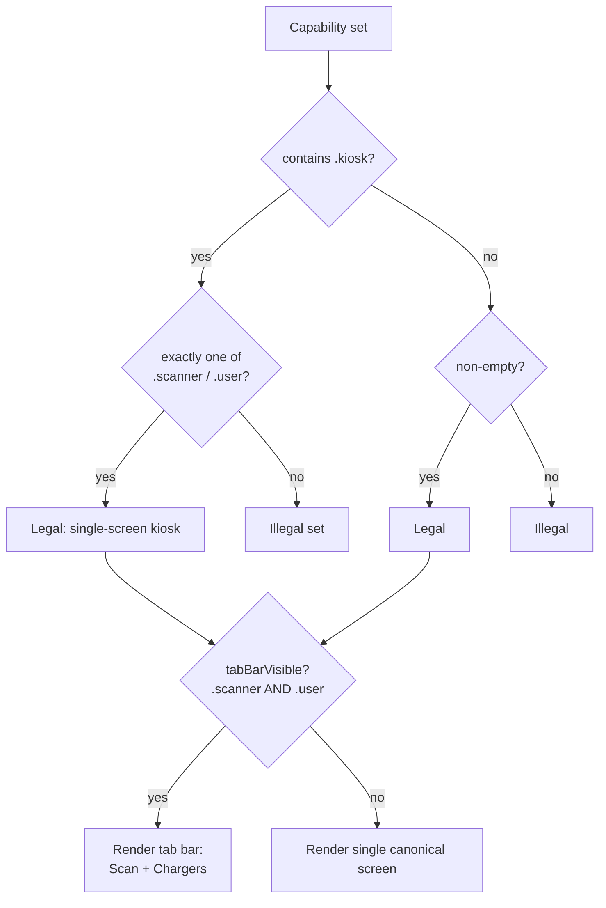

import Glossary from "@components/Glossary.astro";

A registered iOS device declares a set of [capabilities](/glossary#capability) — `.scanner`, `.user`, `.kiosk`, `.managed`, `.charger` — and that set, not a separate role or mode flag, determines what the app shows and what it lets the user do. Understanding the capability set is the fastest way to predict what a given device will do on launch.

## The model

A capability is a single tag attached to a device record. A device's capability set is a `Set<DeviceCapability>`. The full universe of capabilities is small and fixed:

| <Glossary term="<Glossary term="Capability">Capability</Glossary>">Capability</Glossary> | Meaning |
|---|---|
| `.scanner` | Device can read NFC chargecards. Gates the scan surface. |
| `.user` | Device can list chargers, start/stop sessions, manage [<Glossary term="<Glossary term="Reservation">Reservation</Glossary>">reservations</Glossary>](/glossary#reservation). Gates the Chargers tab. |
| `.kiosk` | Device runs as a single-purpose appliance — no chrome, no settings. |
| `.managed` | Admin-fleet posture; admins may read this device's location. |
| `.charger` | Device *is* a charging station. Never set on an iOS app. |

The set is the source of truth. The app derives every UI decision — which tabs render, whether the tab bar is visible, what the lone "main" surface is — from the set, via the helpers in `Capabilities.swift`.

### Derivation rules

Three capabilities are *canonical* — they each gate the app's one main screen when seen alone:

- `.scanner` → scan surface
- `.user` → Chargers tab
- `.kiosk` → <Glossary term="<Glossary term="Kiosk mode">Kiosk mode</Glossary>">kiosk</Glossary> shell wrapping one of the above

`.managed` and `.charger` are not canonical. They never, by themselves, produce a screen.

### Legality

`DeviceCapability.isLegalSet(_:)` enforces a single structural rule:

> If `.kiosk` is in the set, **exactly one** of `.scanner` or `.user` must also be in the set.

Kiosk is "single-purpose appliance" mode. A kiosk that's both a scanner *and* a user surface is a contradiction — kiosk means one screen, no tabs, no settings. Outside of kiosk, any non-empty subset is legal.

### Tab bar visibility

The bottom tab bar shows iff the device has **both** `.scanner` and `.user`. A device with one canonical capability gets that one screen and no chrome around it. This is what makes a phone configured purely as a scanner feel like a scanner appliance, not a general-purpose app with one tab.

### Metadata

`CapabilityMetadata` carries the display name, description, and SF Symbol for each capability. It exists for two callers:

1. The iOS registration picker (Slice H), which uses `registrationOptions` — every capability except `.charger`, because an iOS app is never a charger.
2. The web-admin parity panel, via the TS mirror at `expresscharge/src/lib/devices/capability-metadata.ts`.

If you add a capability, both files must change together. The mirrored shape is intentional — symbols and copy must read identically across surfaces.

## Why it works this way

A capability set is more honest than a role enum. Real devices in the field are mixtures: an iPad on the wall that's both a scanner and a kiosk; a developer phone that's a scanner and a user surface; a fleet-managed kiosk that's also visible to admins. Roles would multiply combinatorially. Capabilities just add.

The legality rule for kiosk exists because kiosk mode isn't a capability so much as a *posture* — "be exactly one thing, with no escape hatches." That posture only makes sense layered on top of a single canonical capability, so the validator enforces it.

The capability check helpers (`canScan`, `canSeeChargersTab`, `isKiosk`, `tabBarVisible`) are all static functions on `DeviceCapability` taking a `Set`. This keeps the call sites readable at the UI layer — `if DeviceCapability.tabBarVisible(device.capabilities)` reads like English — and keeps the rules in one file rather than scattered across SwiftUI views.

## What this means for you

If you're touching iOS UI code:

- **Never branch on a single capability when a helper exists.** Use `canScan`, `canSeeChargersTab`, `tabBarVisible`. If you need a check that doesn't exist yet, add it to `Capabilities.swift` rather than open-coding `caps.contains(...)` in a view.
- **Don't assume `.user` implies a tab bar.** A user-only device has no tab bar — just the Chargers screen full-bleed. The tab bar appears only when both canonical surfaces are present.
- **Treat `.managed` and `.charger` as non-visual.** They never affect what the user sees on *this* device. `.managed` affects what admins can see *about* this device.

If you're adding a capability:

1. Add the case to `DeviceCapability` in `Models`.
2. Add a `CapabilityMetadata` entry to `all` in canonical order.
3. Decide whether it's canonical (gates a screen) and update `isAppCanonicalCapability` plus any derivation helpers.
4. Mirror the change in `capability-metadata.ts`.
5. Re-check `isLegalSet` — does the new capability participate in any structural rule?

If you're operating a fleet:

- A device's capability set is set at registration and synced via [DeviceSync](/glossary#sync-run). Changing capabilities requires re-registering or an admin edit; users cannot escalate their own device.
- A device with `.managed` exposes its location to admins. This is the only capability with a privacy implication.

## Related

- [Glossary: Capability](/glossary#capability)
- [Glossary: Kiosk mode](/glossary#kiosk-mode)
- Tutorial: Registering an iOS device (Slice H)
- Reference: `DeviceCapability` cases in `Models`