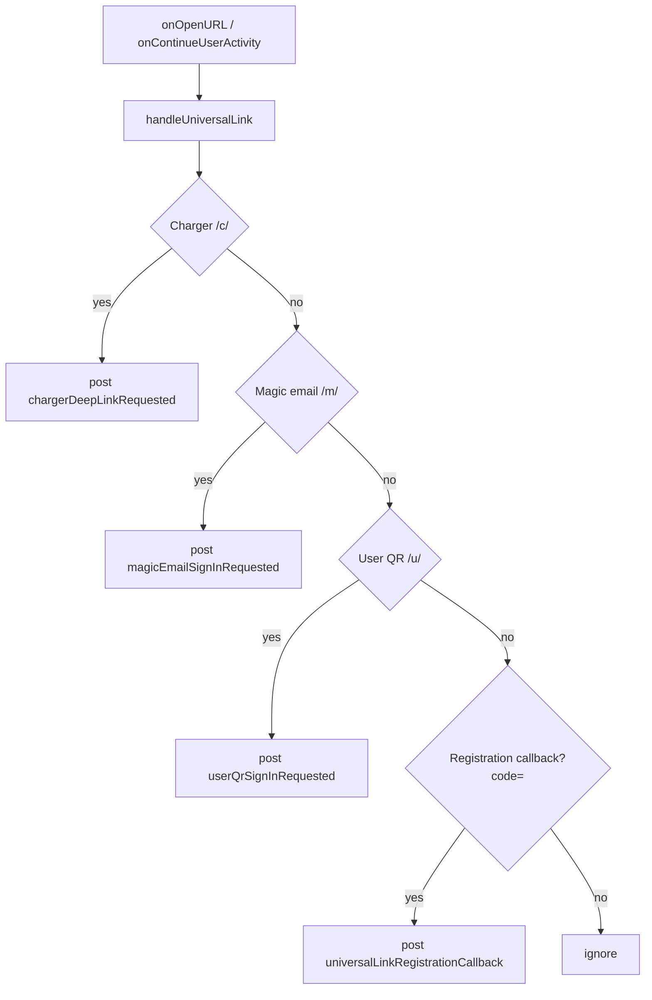
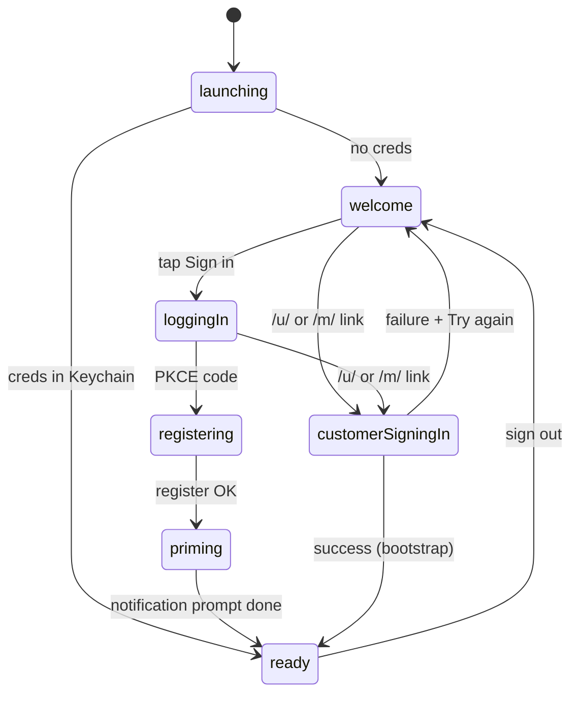

The ExpresScan iOS app is the entry point for several distinct flows
that all arrive as URLs: registration PKCE callbacks, charger sticker
scans, customer QR sign-in, and magic-email sign-in. Every one of
these lands in the same `onOpenURL` / `onContinueUserActivity`
handler on `RootView`, which inspects the URL, decides which flow it
belongs to, and broadcasts a `NotificationCenter` event for the
matching handler to pick up. This page explains the model so you can
add a new link type without breaking the existing ones.

## The model

Three things cooperate to turn a tapped link into a navigated screen:

- **`RootView.handleUniversalLink(_:)`** — the single dispatch
  function. It walks a fixed, ordered list of URL shapes and
  short-circuits on the first match.
- **`AppNotifications`** — typed `Notification.Name` constants. The
  dispatch function posts; feature views (or `RootView` itself, in
  some cases) subscribe.
- **`RootCoordinator`** — the [`@Observable`](#) router that owns
  `RootRoute`. Sign-in flows mutate `coordinator.route` to drive the
  progress UI; navigation flows leave the route alone and let the
  current shell react to the notification.

### Supported link shapes

Each handled link has both a Universal Link form (HTTPS, validated by
AASA) and a custom-scheme form (used by some QR codes and by iOS 18's
unified delivery). The dispatch function treats them identically once
parsed into `URLComponents`.

| Purpose | Universal Link | Custom scheme | Handler |
|---|---|---|---|
| Charger sticker | `https://&lt;host&gt;/c/&lt;id&gt;` | `expchg://c/&lt;id&gt;` | `chargerDeepLinkRequested` |
| Magic-email sign-in | `https://&lt;host&gt;/m/&lt;token&gt;` | — | `magicEmailSignInRequested` |
| User QR sign-in | `https://&lt;host&gt;/u/<publicId>` | — | `userQrSignInRequested` |
| Registration PKCE callback | `https://&lt;host&gt;/&lt;callback&gt;?code=…` | — | `universalLinkRegistrationCallback` |

### Dispatch order

The order in `handleUniversalLink` is load-bearing: each parser is
permissive enough that ambiguity is possible, so the most specific
shapes are checked first and the generic PKCE callback is last.

### Auth-gating sign-in links

The two customer sign-in flows (QR and magic-email) only run when the
app is in an unauthenticated state. `RootView` filters on
`coordinator.route` before calling into the sign-in view-models:

When the app is already in `.ready`, the QR and magic-email handlers
return early — the user is already signed in, so re-running sign-in
is a no-op. Charger and PKCE links are unaffected by this gate.

### The sign-in pipeline

Customer sign-in via deep link drives a phased status sequence
(`confirming → finalizing → success` or `failure(message:)`) through
the `.customerSigningIn` route. On success, the route handler calls
`coordinator.bootstrap(environment:)` rather than transitioning
directly to `.ready`; bootstrap re-reads the Keychain, picks up the
freshly persisted credentials, and advances the route from there.
This keeps the single "creds in Keychain → `.ready`" path
authoritative — there's no second place that mints a signed-in
session.

## Why it works this way

**One dispatcher, many flows.** Putting every URL through a single
parser keeps Universal Link handling testable and audit-able. New
link types are a parse function and a case in
`handleUniversalLink`; they can't accidentally shadow each other
because the ordering is explicit.

**`NotificationCenter` instead of direct calls.** The dispatcher
doesn't know which view should react. For charger links, the active
scan or browse shell subscribes; for sign-in links, `RootView`
subscribes to itself. Decoupling via notifications means a link can
fire from `onOpenURL` *or* from `onContinueUserActivity` (legacy
delivery path) without the receivers caring which channel was used.

**Bootstrap is the only path to `.ready`.** Sign-in handlers stop
short of setting `route = .ready` themselves. They write tokens to
the `AuthStore` and call `bootstrap` again, which re-runs the same
"do I have credentials?" check that cold launch uses. One code path
means one set of bugs.

**Cold-launch safety.** `connectivityOverlayBinding` suppresses the
offline overlay during `.launching` so the auth gate isn't fighting
a modal. Same idea for the customer sign-in filter: don't run a
sign-in flow until we know the user isn't already signed in.

## What this means for you

If you're **adding a new deep link**:

1. Pick a path prefix that doesn't collide with existing ones
   (`/c/`, `/m/`, `/u/`, registration callback).
2. Add the path to the iOS AASA file and to
   `apple-app-site-association` on the web side.
3. Write a `parse…DeepLink(_ components:)` helper that returns the
   extracted payload or `nil` — validate length and character set so
   crafted URLs don't trigger network calls.
4. Add a `Notification.Name` to `AppNotifications`.
5. Insert a new branch in `handleUniversalLink` **before** the
   registration callback check. Order it among the others by
   specificity.
6. Subscribe from the view that should react.

If you're **debugging a link that doesn't open the right screen**:

- Confirm the URL reaches `handleUniversalLink` at all — log inside
  `onOpenURL` *and* `onContinueUserActivity`. iOS 18 prefers the
  former, but older delivery paths still use the latter.
- Check the dispatch order. A `/u/abc` link will not reach the user
  QR handler if a new branch above it greedily matches.
- For sign-in flows, check `coordinator.route`. The handler exits
  silently from `.ready` and any other authenticated route.

If you're **writing tests**: the dispatcher is pure (URL in,
notification out). You can drive it from a snapshot test by
constructing `URLComponents` and asserting the posted notification,
without standing up a `RootCoordinator`.

## Related

- [Tutorial: Add a Universal Link path](#) — end-to-end, including
  the AASA changes.
- [Runbook: Universal Links not opening the app](#) — AASA, entitlements,
  reinstall checklist.
- [Concept: Registration PKCE flow](#) — what happens after the
  `?code=` callback fires.
- [Concept: Customer sign-in methods](#) — QR vs magic-email vs future
  NFC, and how they share `CustomerSignInPhase`.