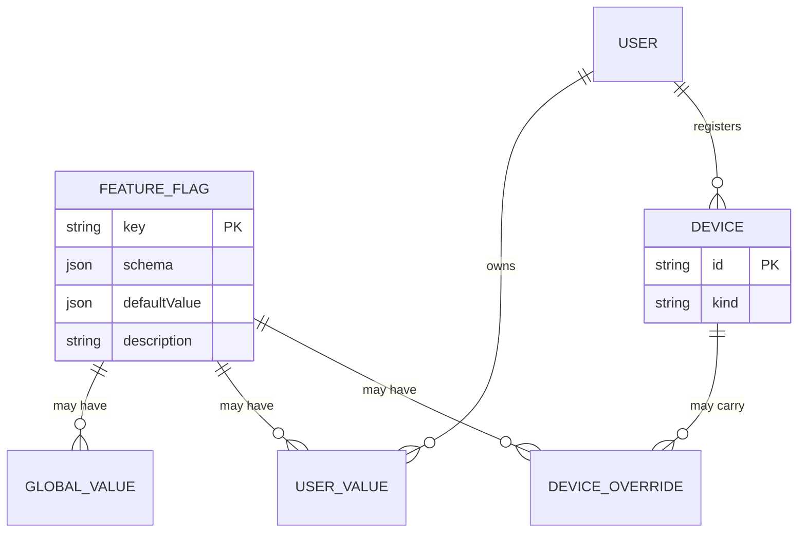
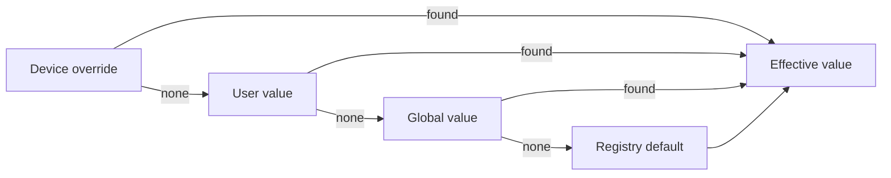

import Glossary from "@components/Glossary.astro";

Feature flags are runtime toggles the service flips without shipping
a new app release. They let operators dark-launch UI, gate
diagnostic surfaces, or quiet a known-broken check on a single
device — all without a TestFlight cycle. This article explains the
model behind the registry: how flags are declared, how an effective
value is resolved across tiers, and what actually crosses the wire.

## The model

A feature flag is a strongly-typed entry in a central registry. Each
flag carries a Zod schema, a default value, and a human-readable
description. The registry lives in
`web/src/lib/devices/feature-flags.ts` and is the single source of
truth — there is no implicit flag creation, no string-typed bag of
toggles.

### Entities

A flag key uses dot-namespacing (`customer.connectivityCheck`), which
lets future tooling group related flags (e.g. all `customer.*`
toggles) without a separate grouping field.

Every flag is settable at every tier: global, user, and device
override. The picker UI no longer surfaces a scope selector — scope
is uniformly `"both"`. The only schema-level restriction is which
device kinds may carry an override: phone, tablet, and laptop NFC
readers are eligible; chargers are not. A database trigger enforces
this; `isFeatureFlagEligibleKind` mirrors it for application-side
short-circuits.

### Resolution

When a device asks the service for its current flag set, the resolver
walks four tiers and returns the first value found:

Concretely: `device_override ?? user_value ?? global_value ?? registry_default`.

The registry default is always defined, so resolution always
terminates with a typed value.

### What crosses the wire

The device-sync envelope's `flags` map is **default-omit**. The
resolver only emits a flag when its effective value differs from the
registry default. Three consequences fall out of this:

- A freshly registered device receives an empty `flags` map and uses
  registry defaults locally. That's the intended steady state.
- Flags that are "inactive" (no overrides anywhere) never appear in
  network traffic, keeping payloads small and free of noise.
- Flipping a flag back to its default on the admin side actively
  removes it from the wire, rather than sending the default
  redundantly.

## Why it works this way

**Typed registry instead of a string bag.** A typo in a flag key on
the server should not silently round-trip through the resolver and
land on a device. Zod schemas are `.strict()` so unknown fields are
rejected, and the `FeatureFlag` type narrows arbitrary strings via
`isFeatureFlag`. The registry doubles as the contract the admin UI
introspects to render editors and tooltips.

**Four-tier resolution, not three.** A global tier sits between
user-specific values and registry defaults so an operator can roll
out a change to everyone without iterating per-user rows. Device
overrides remain the most specific knob — useful when one tablet has
a known-broken sensor and you want to mute its self-check without
hiding the check for the rest of the fleet.

**Open consumer on iOS.** The Swift consumer in
`Sources/DeviceSync/FeatureFlagReader.swift` is intentionally
string-keyed with no static type registry. The TypeScript registry is
the contract; the iOS side reads opportunistically and falls back to
its own compiled-in defaults when a key is absent. This means a new
flag can ship server-side ahead of the app build that reads it,
without breaking older clients.

## What this means for you

**Adding a flag.** Three steps, in order:

1. Add an entry to `FEATURE_FLAGS` with a Zod schema, default value,
   and description.
2. Mirror the key in `FeatureFlagReader.swift` so the iOS consumer
   knows what to ask for. No type registry there — just the string
   key and a default.
3. The admin "Feature Flags" UI picks up the new entry
   automatically; no UI wiring required for per-user or per-device
   overrides.

**Picking a default.** Defaults should reflect the steady-state
desired behavior for an unconfigured fleet, because the wire format
omits matching values. If you flip the default later, every device
that was relying on the implicit default will see the change on its
next sync — that's usually what you want, but it's not free.

**Reading a flag.** On the server, use `getFeatureFlagDefault(key)`
for the fallback and the resolver for the effective value. Never
read flag values out of a free-form map without going through the
type guard — strict-mode Zod will reject typo'd keys, but only if
you actually run them through the schema.

**Device eligibility.** If you're writing admin UI that lets an
operator pick a device for a flag override, gate the picker with
`isFeatureFlagEligibleKind`. The database trigger will reject a
charger override anyway, but failing in the UI is friendlier.

## Related

- [Tutorial: Add a new feature flag](/tutorials/add-feature-flag/)
- [Reference: Device sync envelope](/reference/device-sync-envelope/)
- [Runbook: Roll out a flag across the fleet](/runbooks/feature-flag-rollout/)
- [Concepts: <Glossary term="<Glossary term="Capability">Capability</Glossary>">Capability</Glossary>](/concepts/capability/) — compile-time device
  abilities, the complement to runtime-toggled flags