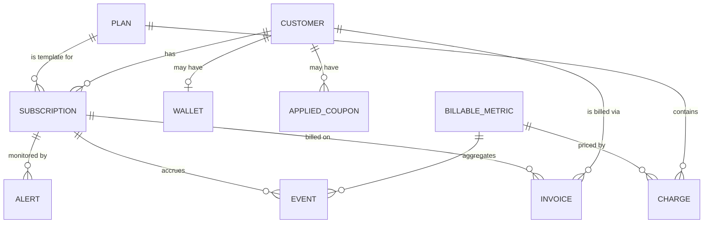
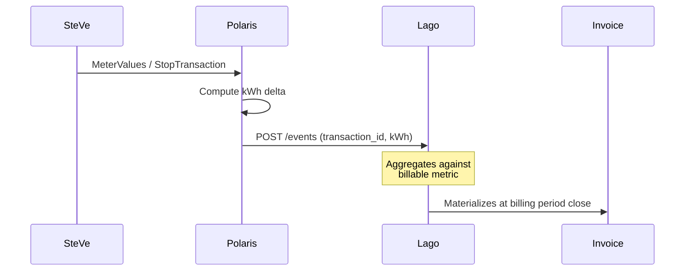
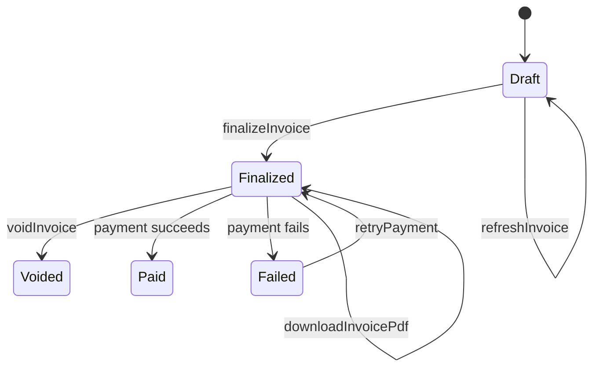

import Glossary from "@components/Glossary.astro";

import { Aside } from "@astrojs/starlight/components";

Polaris Express does not bill anyone itself. Every customer record,
plan, usage counter, coupon, and invoice lives in [<Glossary term="<Glossary term="<Glossary term="Lago">Lago</Glossary>">Lago</Glossary>">Lago</Glossary>](/glossary#lago) —
an open-source billing platform we treat as the system of record for
money. This page explains how the pieces fit together so that when you
read `lago-client.ts` or chase a missing invoice line, you know which
entity owns what.

## The model

Lago's domain is small but layered. The four entities you'll touch
daily are **customer**, **subscription**, **<Glossary term="<Glossary term="<Glossary term="Lago metric">Lago metric</Glossary>">Lago metric</Glossary>">billable metric</Glossary>**, and
**invoice**. Wallets, coupons, and alerts hang off the customer or
subscription as modifiers.

### Customer

The [<Glossary term="<Glossary term="<Glossary term="Lago customer">Lago customer</Glossary>">Lago customer</Glossary>">Lago customer</Glossary>](/glossary#lago-customer) is identified by an
`external_id` we choose — for Polaris that's the user's
[public ID](/glossary#public-id). Lago's `POST /customers` is
upsert-by-`external_id`, which is why `createCustomer` and
`updateCustomer` in `lago-client.ts` both hit the same endpoint. The
customer record carries billing address, tax identifiers, currency,
and the link to a wallet if the customer prepays.

### Subscription

A [<Glossary term="<Glossary term="<Glossary term="Lago subscription">Lago subscription</Glossary>">Lago subscription</Glossary>">Lago subscription</Glossary>](/glossary#lago-subscription) attaches a customer
to a plan. The subscription — not the customer — is the unit of
billing: usage is reported against a subscription, invoices are issued
per subscription, and alerts fire per subscription.

Subscriptions also carry a `metadata` map. Polaris uses this to mirror
the active [charging profile](/glossary#charging-profile) so the
billing system has a self-contained view of what the customer is
entitled to. Because Lago's update endpoint replaces `metadata`
wholesale, the client exposes `getSubscription` (with the metadata-
tolerant schema) so callers can read-modify-write safely.

### Plan, charge, and billable metric

A plan is the price sheet. It is composed of one or more **charges**,
each of which references a [billable metric](/glossary#lago-metric) and
a `charge_model` (standard, graduated, volume, package, percentage).
The metric defines _what_ is being counted; the charge defines _how_
that count is priced.

Polaris's main metric is energy delivered (kWh). The startup safety
gate uses `getBillableMetric` to assert `aggregation_type === "sum_agg"`
before any event enrichment happens — if someone changes the metric to
`count_agg` in the Lago UI, we'd silently bill by session count
instead of energy. The gate prevents that.

### Event

Events are how usage gets into Lago. Every event carries:

- `transaction_id` — your idempotency key. Lago dedupes on this.
- `external_subscription_id` — which subscription accrues the usage.
- `code` — which billable metric this event feeds.
- `properties` — the dimensions the metric aggregates over (for
  `sum_agg`, this includes the numeric field being summed).

Events are append-only. To correct a mistake, send a compensating
event with a fresh `transaction_id` — never reuse one. The batch
endpoint accepts up to 100 events per call; `createBatchEvents`
enforces this limit client-side.

### Invoice

An invoice is the materialization of a billing period. Lago generates
it automatically when a subscription's period closes, but the lifecycle
has explicit states the API surfaces:

`refreshInvoice` re-computes fees against current usage and only
works while the invoice is still draft. Once finalized, the amount is
locked — corrections require either `voidInvoice` plus a new one-off
invoice, or a credit through the wallet.

### Wallets, coupons, and alerts

These are modifiers on the basic customer/subscription model:

- **Wallets** hold prepaid credit. A wallet transaction either adds
  credit (paid or granted) or consumes it against an invoice. Polaris
  uses wallets for top-up flows; Lago handles the consumption order.
- **Applied coupons** sit between a coupon definition and a customer.
  When Polaris flips a user to `comped`, it calls
  `createAppliedCoupon` with a 100%-off recurring coupon. Flipping back
  calls `terminateAppliedCoupon`.
- **Subscription alerts** fire webhooks when usage crosses thresholds.
  Polaris uses these to warn drivers approaching their plan cap.

### One-off invoices

Some charges aren't tied to a subscription cycle — a one-time
activation fee, a hardware refund, a manual adjustment. Lago OSS
v1.45 has no separate `/applied_add_ons` endpoint, so these go through
`createOneOffInvoice` (`POST /invoices` with add-on codes in `fees[]`).

## Why it works this way

**Lago is the source of truth for money.** Polaris's database tracks
who the user is, what they charged, and what tariff was active — but
the canonical "what does the customer owe" answer comes from Lago.
This split keeps tariff logic in our codebase and invoicing logic in
Lago's.

**Events, not balances.** Polaris never tells Lago "this customer owes
€12.50." It tells Lago "subscription X consumed 47.3 kWh under
transaction Y." The price is applied by the plan's charges at
aggregation time. This means a retroactive tariff change in the Lago
UI can re-price draft invoices without any Polaris involvement —
useful, and occasionally dangerous, which is why the billable-metric
safety gate exists.

**Idempotency via `transaction_id`.** Webhooks retry. <Glossary term="<Glossary term="<Glossary term="OCPP">OCPP</Glossary>">OCPP</Glossary>">OCPP</Glossary> messages
arrive twice. Network calls time out mid-flight. Lago's dedupe on
`transaction_id` lets us send the same event repeatedly without
inflating usage — provided we generate that ID deterministically from
the underlying OCPP transaction and meter cursor.

## What this means for you

If you're integrating with Lago from another part of Polaris:

- **Identify customers by `external_id`** — the user's public ID. Do
  not pass Lago's internal `lago_id` around; it's an implementation
  detail.
- **Generate stable `transaction_id`s.** A good pattern is
  `${ocppTransactionId}:${meterCursor}`. Never derive it from
  `Date.now()` or a random UUID at send time.
- **Read schemas, not raw JSON.** Every method in `lago-client.ts`
  validates with Zod. If a field you need isn't in the schema, add it
  to `types/lago.ts` rather than reaching into the response with
  `any` — it'll keep the safety gate honest.
- **Don't update subscription metadata blind.** Lago's PUT replaces
  the whole `metadata` object. Always `getSubscription` first, merge,
  then `updateSubscription`.
- **Treat draft and finalized invoices differently.** `refreshInvoice`
  is safe on drafts and an error on finalized invoices. Surface that
  distinction in any operator-facing UI.

<Aside type="caution" title="PDF generation is async">
`downloadInvoicePdf` triggers generation; `file_url` may be null until
a background job in Lago completes. Poll `getInvoice` until the URL
populates rather than blocking on the trigger response.
</Aside>

## Related

- [How tariffs map to Lago plans](/concepts/tariff-to-plan-mapping/)
- [Reporting usage events from OCPP](/tutorials/report-usage-events/)
- [Reconciling a missing invoice](/runbooks/reconcile-missing-invoice/)
- [Flipping a user to comped](/runbooks/flip-user-to-comped/)
- [Glossary: Lago, Lago customer, Lago subscription, Lago metric](/glossary/)