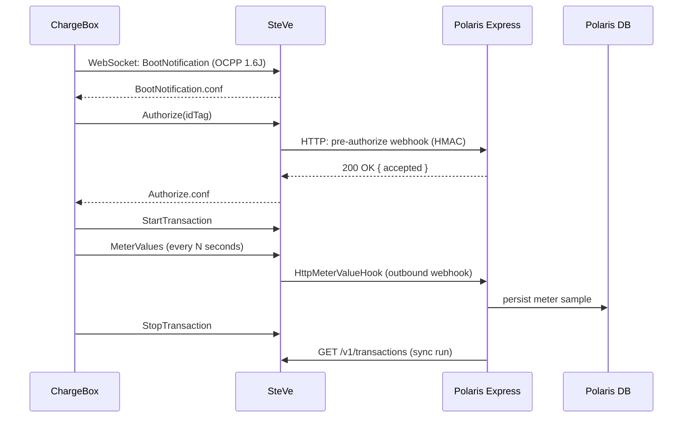

import Glossary from "@components/Glossary.astro";

import { Aside } from '@astrojs/starlight/components';

Polaris Express does not talk to chargers directly. Every command,
every meter reading, every authorization decision flows through
[<Glossary term="<Glossary term="<Glossary term="SteVe">SteVe</Glossary>">SteVe</Glossary>">SteVe</Glossary>](/glossary#steve) — an open-source <Glossary term="<Glossary term="<Glossary term="OCPP">OCPP</Glossary>">OCPP</Glossary>">OCPP</Glossary> central system the
fork of which is vendored into this repo. Understanding the boundary
between Polaris and SteVe is the difference between a five-minute bug
fix and a five-hour wild goose chase.

## The model

[OCPP](/glossary#ocpp) (Open Charge Point Protocol) is the wire
protocol every supported charger speaks. Polaris Express targets
**OCPP 1.6J** (JSON over WebSocket) in practice — SteVe also supports
1.2 and 1.5, plus the SOAP variants, but our fleet runs 1.6J.

In OCPP, the [<Glossary term="<Glossary term="<Glossary term="ChargeBox">ChargeBox</Glossary>">ChargeBox</Glossary>">ChargeBox</Glossary>](/glossary#chargebox) is the client. It opens
a persistent WebSocket to the central system and exchanges messages
like `BootNotification`, `Heartbeat`, `StatusNotification`,
`StartTransaction`, `MeterValues`, and `StopTransaction`. The central
system can push commands back: `RemoteStartTransaction`,
`RemoteStopTransaction`, `ReserveNow`, `UnlockConnector`,
`ChangeConfiguration`, and so on.

SteVe is the central system. It terminates the WebSocket, persists
the OCPP state into MariaDB, and exposes a REST API plus an admin web
UI on top of that database. Polaris Express is a REST client of
SteVe — it never sees a raw OCPP frame.

### Three integration surfaces

There are exactly three places where Polaris and SteVe meet. If you
are building a feature that touches chargers, you are using one of
these:

1. **SteVe REST API → Polaris (pull).** Polaris polls SteVe for
   transactions, [idTags](/glossary#idtag), charge boxes, and
   <Glossary term="<Glossary term="<Glossary term="Reservation">Reservation</Glossary>">Reservation</Glossary>">reservations</Glossary>. This is the read path. See `web/src/lib/steve-client.ts`.
2. **SteVe REST `/v1/operations/*` → ChargeBox (push).** Polaris
   issues remote commands by POSTing to SteVe, which queues a task
   and forwards the OCPP message to the charger over its WebSocket.
   SteVe returns a `taskId` immediately; Polaris polls
   `/v1/operations/tasks/{taskId}` for the eventual ChargeBox reply.
3. **SteVe → Polaris (push).** Our fork adds two outbound webhooks
   so Polaris doesn't have to poll for live data:
   - `HttpMeterValueHook` fires on every `MeterValues` frame.
   - The [pre-authorize](/glossary#pre-authorize) hook fires on
     `Authorize` (and on `StartTransaction` when an <Glossary term="<Glossary term="<Glossary term="idTag">idTag</Glossary>">idTag</Glossary>">idTag</Glossary> is present)
     so Polaris can decide whether to accept the swipe.

### The fork

We run a friendly fork of `steve-community/steve` (currently 3.12.0)
on the `expressync-preauth` branch. The fork is intentionally thin —
every change is documented in `steve/CLAUDE.md` and exists to support
ExpresSync integration:

- **`HttpMeterValueHook`** — the meter-value webhook above.
- **`GET /api/v1/operations/tasks/{taskId}`** — a clean 404 instead
  of upstream's 500 + stack trace when a task has been evicted from
  the in-memory `TaskStore`.
- **Build-user grants and env wiring** — runtime secrets
  (`DB_PASSWORD`, `AUTH_PASSWORD`, `WEBAPI_VALUE`) injected as
  `-D` JVM properties at startup; nothing real is committed.

Everything else — OCPP message handling, the admin UI, the database
schema, Flyway migrations — is stock upstream. When upstream
releases, we rebase `expressync-preauth` on top of `master`.

## Why it works this way

**Why not talk OCPP directly?** OCPP 1.6J is a stateful protocol with
charger-specific quirks, security profiles (0 through 3, including
mTLS), and a long tail of vendor extensions. SteVe has eaten that
complexity for a decade. Reimplementing the central system would buy
us nothing and lose us the upstream community's compatibility
testing.

**Why a fork and not a plugin?** SteVe has no plugin API. Adding an
outbound webhook means adding a Java class to the message hook chain
and recompiling. The fork is the supported extension mechanism — and
it stays small enough to rebase against upstream without drama.

**Why webhooks for <Glossary term="<Glossary term="<Glossary term="Meter value">Meter value</Glossary>">Meter value</Glossary>">meter values</Glossary>, REST polling for everything else?**
Meter values are high-frequency (every 10–60 seconds per active
transaction) and only matter while the transaction is live. Polling
SteVe at that cadence would be wasteful and would still lag the
charger. Transactions and idTags, by contrast, are low-frequency and
benefit from the batch semantics of a [sync run](/glossary#sync-run).

**Why poll task status instead of streaming it?** OCPP commands are
asynchronous — SteVe sends the request to the charger and gets a
reply seconds later. Upstream SteVe keeps `TaskStore` in memory only;
results aren't durable. Our fork adds the REST endpoint that exposes
the same in-memory store, and `steveClient.operations.getTask()`
treats 404 as "evicted or not yet arrived" rather than an error.

## What this means for you

**Schema migrations and OCPP data live in SteVe, not Polaris.** The
SteVe database (`stevedb`) is owned by SteVe's Flyway migrations.
Polaris reads from SteVe via the REST API and caches what it needs
into its own database (the `chargers` table, for instance, is a
Polaris-side cache refreshed at the end of every sync run, with
`first_seen_at` / `last_seen_at` so offline chargers stay visible).
Do **not** add tables or columns to `stevedb` — that path leads to
rebase pain.

**Use the typed client, not raw `fetch`.** `steveClient` in
`web/src/lib/steve-client.ts` handles auth (HTTP Basic with the
`webapi.value` token), retries, timeouts, Zod validation, and the
selection-shape normalization that SteVe's `/v1/operations/*`
endpoints expect (`chargeBoxIdList: [...]`, not `chargeBoxId`). All
new OCPP operations go through `steveClient.operations.*`.

**Destructive operations are deliberately absent from the client.**
`Reset`, `ClearCache`, `UpdateFirmware`, `SendLocalList`, and
`ClearChargingProfile` are not exposed. Use the SteVe admin UI at
`/steve/manager` for those — they need human eyes on the consequences.

**The pre-authorize webhook is on the hot path of every swipe.** A
slow or flaky Polaris endpoint will make every card tap feel slow at
the charger. Keep that handler under 500ms p99 and treat it like the
critical path it is.

**When something looks wrong, check both sides.** Is the charger
actually connected to SteVe? (`/steve/manager` shows last heartbeat.)
Is SteVe accepting the operation? (Check the inline POST response —
SteVe rejects unknown chargeBoxIds before queueing anything.) Did
the charger reply? (Poll the task, or check `ocpp_task_status` in
the Polaris DB.) These are three different failures with three
different fixes.

## Related

- [Run SteVe locally](/tutorials/run-steve-locally) — Docker
  Compose, env files, first heartbeat.
- [Rebase the SteVe fork on upstream](/runbooks/rebase-steve-fork)
- [Configure a charger for pre-authorize](/runbooks/charger-preauth-config)
- [Issue an OCPP operation from Polaris](/tutorials/issue-ocpp-operation)
- [Glossary: OCPP](/glossary#ocpp), [SteVe](/glossary#steve),
  [ChargeBox](/glossary#chargebox), [idTag](/glossary#idtag),
  [pre-authorize](/glossary#pre-authorize),
  [sync run](/glossary#sync-run)