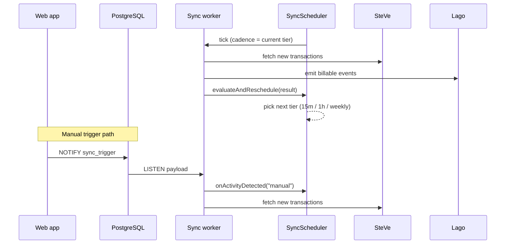

import Glossary from "@components/Glossary.astro";

A **sync run** is one pass of the reconciliation worker: it reads completed <Glossary term="<Glossary term="OCPP">OCPP</Glossary>">OCPP</Glossary> transactions out of <Glossary term="<Glossary term="SteVe">SteVe</Glossary>">SteVe</Glossary>, enriches them, and emits billable events into <Glossary term="<Glossary term="Lago">Lago</Glossary>">Lago</Glossary>. **<Glossary term="<Glossary term="Adaptive Cadence">Adaptive Cadence</Glossary>">Adaptive Cadence</Glossary>** is the scheduler that decides how often those runs happen — every 15 minutes when the site is busy, hourly when it's quiet, weekly when it's effectively dormant. This page explains the model so you know what to expect when you read worker logs, design new triggers, or debug a missing invoice line.

## The model

The sync worker is a long-lived Deno process running in its own container. It owns three independent loops plus a handful of janitorial crons. The loop that matters here is the sync loop, driven by `SyncScheduler` rather than a fixed cron expression.

### Three cadence tiers

Adaptive Cadence has three discrete states. The scheduler never runs continuously and never picks an arbitrary interval — it always sits in one of these tiers.

| Tier        | Interval     | When it applies                                   |
|-------------|--------------|---------------------------------------------------|
| **Active**  | every 15 min | A sync run recently produced events, or a manual trigger arrived. |
| **Idle**    | every 1 hour | The last run produced no events but transactions exist. |
| **Dormant** | weekly       | Long stretch with no transaction activity at all. |

After every sync run the worker calls `SyncScheduler.evaluateAndReschedule(result)`, passing the `SyncResult`. The scheduler looks at `eventsCreated`, `transactionsProcessed`, and elapsed-time signals, then schedules the next tick. The tier transition is the entire state machine — there is no other knob.

### Two ways a run is triggered

A sync run starts in one of two ways:

1. **Scheduled tick.** The current tier fires and the worker calls `handleSync()`. This is the default path.
2. **Manual trigger.** Something — the dashboard button, an API caller, a webhook — calls `triggerSync()`, which issues `NOTIFY sync_trigger` against Postgres. A dedicated `LISTEN` connection inside the worker receives the payload and calls `SyncScheduler.onActivityDetected(...)` before invoking `handleSync()`. Recording activity first guarantees the worker is in the Active tier when the run finishes evaluating cadence, so subsequent natural runs stay fast.

The manual path is fire-and-forget. The API returns success as soon as the `NOTIFY` is sent; it does **not** wait for the sync to complete. If the worker is down, the notification is dropped — Postgres `LISTEN/NOTIFY` is not durable.

### Overlap protection

A single `isSyncing` flag prevents two <Glossary term="<Glossary term="Sync run">Sync run</Glossary>">sync runs</Glossary> from executing at once. If a manual trigger fires during a scheduled run, the second call logs `Sync already in progress, skipping...` and returns. The cron scheduler itself also has `protect: true` set on all jobs, so overlapping cron ticks are dropped before they reach the handler.

### What else runs in the same worker

The sync worker container also hosts unrelated, fixed-cadence crons. These are independent of Adaptive Cadence and run on their own `Cron` instances:

- **Rate-limit + audit cleanup** every 2 minutes (`rate_limits`, `verifications`, `auth_audit`, `magic_link_audit`, idempotency keys).
- **`device_logs` retention prune** every 6 hours, in 10 000-row batches.
- **`device_logs` size alarm** daily at 06:00 UTC, warning above 1 GiB.
- **<Glossary term="<Glossary term="Reservation">Reservation</Glossary>">Reservation</Glossary> status resolver** every minute, polling pending [Reservation](/glossary#reservation) rows for SteVe confirmation.

If you see worker log lines that aren't about syncing, they probably come from one of these.

## Why it works this way

A fixed 15-minute cron was the original design and it worked, but it had two costs that mattered at scale:

- **SteVe and Lago got hammered overnight** at sites that close. Hundreds of empty sync runs per week, each one touching the OCPP database and the Lago API for nothing.
- **Manual triggers were second-class.** Operators clicking "Trigger Sync" had no way to nudge the cadence — the next scheduled run was still 15 minutes away regardless of how quiet the day had been.

Adaptive Cadence collapses both problems. Activity (real or manual) pulls the scheduler into the Active tier. A quiet result pushes it toward Idle, then Dormant. The tier is the cadence — there's no separate "is this site busy?" cache to keep in sync.

The three-tier design is deliberately coarse. Continuous adaptation would have been harder to reason about in incident reviews ("why did we miss this transaction for 47 minutes?") and the difference between 12 and 18 minutes of latency doesn't matter for billing. Three named tiers are easy to log, easy to alert on, and easy to override.

### The override escape hatch

If `SYNC_CRON_SCHEDULE` is set to a non-empty cron expression in the worker's environment, the adaptive scheduler still owns the loop, but the cadence is pinned. Use this for load tests, staging environments where you want deterministic timing, or incident response where you need to force a known interval. The worker logs the override on startup so it's obvious in production logs.

## What this means for you

**If you're calling the sync API from new code:** treat `POST /api/sync` as an asynchronous nudge, not a synchronous reconcile. It returns immediately once the `NOTIFY` is queued. If you need to know whether a specific transaction made it into Lago, poll the data — don't infer it from the HTTP response.

**If you're writing a webhook that should trigger a sync:** call `triggerSync("your-source-name")` instead of `runSync()` directly. The custom source identifier shows up in worker logs, which makes it possible to attribute manual sync runs back to their origin during incident reviews.

**If you're debugging a missing billing event:** check the current tier first. `SyncScheduler.currentTier()` is logged on every worker startup and after every tick. A Dormant site won't sync for up to a week unless something triggers activity. If that's the bug, the fix is usually to wire the upstream event into `onActivityDetected()` — not to shorten the cadence.

**If you're reviewing worker logs:** lines like `[Sync Worker] reservation resolver: polled=...` are not sync runs. Sync runs always look like `[Sync Worker] Sync completed in Xs: N events created, M transactions processed`. Cleanup crons are clearly prefixed with their table name.

**If you're operating the worker:** the process is designed to be killed and restarted cheaply. Shutdown is graceful — it stops the scheduler, waits for any in-flight sync to finish, then closes the `LISTEN` connection. Manual triggers issued during a restart are lost; the next scheduled tick will catch up.

## Related

- [Trigger a manual sync](/tutorials/trigger-manual-sync) — the operator-facing how-to.
- [Investigate a missing billing event](/runbooks/missing-billing-event) — runbook that uses tier state as its first signal.
- [<Glossary term="<Glossary term="Lago metric">Lago metric</Glossary>">Lago metric</Glossary> safety](/concepts/lago-metric-safety) — what `ensureLagoMetricSafety` guards against on worker startup.
- [Reservation lifecycle](/concepts/reservation-lifecycle) — how the reservation resolver cron fits in.