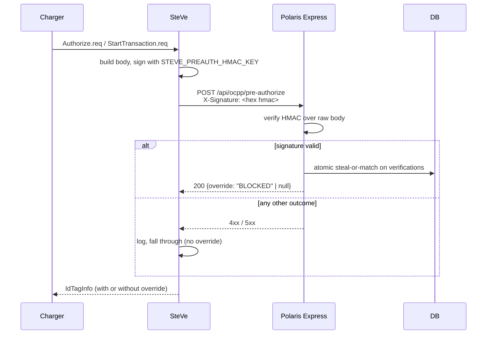
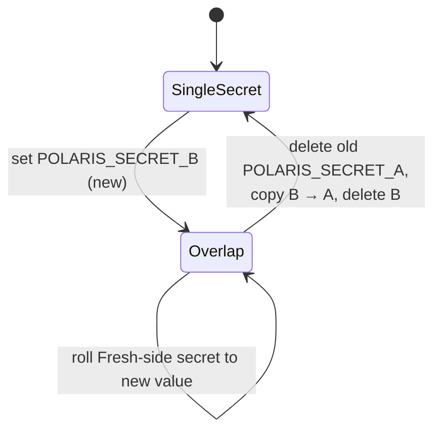

import Glossary from "@components/Glossary.astro";

Polaris Express receives high-trust callbacks from systems that sit on
the wire between a customer's tap and a charger starting: <Glossary term="<Glossary term="<Glossary term="SteVe">SteVe</Glossary>">SteVe</Glossary>">SteVe</Glossary>'s
Pre-Authorize hook, SteVe's <Glossary term="<Glossary term="<Glossary term="Meter value">Meter value</Glossary>">Meter value</Glossary>">MeterValues</Glossary> hook, and the Cloudflare email
worker that the Fresh app drives. None of these callers can carry a
session cookie, and all of them must be cheap to verify under a tight
budget. We use a single shared contract — **a hex HMAC-SHA256 over the
raw request body, in a header** — and layer integrity, replay
protection, and fail-open semantics on top of it.

## The model

Every signed webhook into Polaris Express has four moving parts:

- **A shared secret**, scoped to a single hook (`STEVE_PREAUTH_HMAC_KEY`,
  `STEVE_METERVALUE_HMAC_KEY`, `POLARIS_SECRET_A` / `_B`). One secret
  per hook means rotating one doesn't ripple into the others.
- **A raw body**, JSON in practice but treated as opaque bytes. The
  signature covers the bytes on the wire, not the parsed payload — so
  whitespace and key ordering matter, and we read `req.text()` *before*
  `JSON.parse`.
- **A signature header**, lower-case hex of `HMAC-SHA256(secret, body)`.
  SteVe sends `X-Signature`; the email worker uses `X-Polaris-Sig`. The
  header name is per-hook, the algorithm is not.
- **A verifier** that imports the key once, decodes the hex, and calls
  `crypto.subtle.verify` (constant-time). The imported `CryptoKey` is
  cached on the module for the lifetime of the process.

### The verification pipeline

Both <Glossary term="<Glossary term="<Glossary term="OCPP">OCPP</Glossary>">OCPP</Glossary>">OCPP</Glossary> hook handlers run the same five steps in order:

1. **Read the raw body as text.** A failure here is `400 invalid_body`.
2. **Read the signature header.** Missing header or missing server-side
   key is `401 unauthorized`.
3. **Hex-decode the signature.** Odd length or non-hex bytes is `401`.
4. **`crypto.subtle.verify`.** A thrown exception is `500 internal`;
   `false` is `401`.
5. **Parse JSON, validate shape.** Bad JSON is `400 invalid_json`;
   missing required fields is `400 invalid_body`.

Only after all five does the handler do anything observable — touch
the database, publish an event, or enqueue a billing sample.

### Replay protection (email worker)

The Pre-Authorize and MeterValues hooks don't need explicit replay
protection because the operations they trigger are idempotent at the
business layer: the atomic `steal-or-match` SQL returns the same
override for the same `(chargeBoxId, idTag)`, and meter samples are
keyed by `transactionPk` + timestamp.

The email worker is different — replaying a signed send-email request
would actually re-send the email. So it layers two more checks after
HMAC:

- **Timestamp window.** Reject if `|now − ts| > 5 min`.
- **Nonce deduplication.** Reject if `sha256(nonce)` is already in the
  `EMAIL_NONCE_DEDUP` KV (TTL 10 min, wider than the timestamp window
  on purpose).

Together they bound replay to "an attacker who captures a live request
and replays it within the next five minutes" — and even then, only
once.

### Two-secret rotation

The email worker accepts a signature from **either** `POLARIS_SECRET_A`
or `POLARIS_SECRET_B`. This is the canonical rotation pattern in the
codebase:

The OCPP hooks don't yet do dual-secret verification — they're a
trusted internal path and rotation requires a brief coordinated
restart. If you're adding a new hook that crosses a trust boundary
(e.g. a partner integration), copy the email worker's pattern.

## Why it works this way

**HMAC over the raw body, not a canonicalized form.** Canonical JSON is
a footgun: any disagreement between signer and verifier on key order,
number formatting, or whitespace produces silent verification failures.
Signing the bytes that hit the wire makes "what was signed" trivially
auditable — it's the same bytes in the request log.

**One secret per hook.** Compromise of the meter-values key doesn't let
an attacker fake pre-authorize decisions or send emails. It also lets
us rotate keys on different schedules — meter values are high-volume
and low-risk; pre-authorize is low-volume and high-risk; email is
external-facing.

**Fail-open for OCPP, fail-closed for everything else.** SteVe's
Pre-Authorize budget is ~200 ms; anything slower or non-2xx means SteVe
falls through to its normal decision and the charger proceeds. That's
the right default for OCPP: ExpresSync going down must never break
charging. The trade-off is that a misconfigured HMAC key silently
defeats scan-to-login until someone notices logs. The email worker
inverts this — any verification failure means no email is sent, full
stop.

**HMAC, not asymmetric signatures.** SteVe is colocated and trusted;
the threat model is "someone on the network forges a request," not
"the signer is compromised." HMAC is faster, simpler, and the rotation
story is the same anyway.

## What this means for you

**Adding a new signed-webhook target.** Copy the verifier block from
`pre-authorize.ts` verbatim. Don't reimplement HMAC — five lines of
"helpful" deviation is how timing attacks happen. Use a new env var
(`<CALLER>_<PURPOSE>_HMAC_KEY`), a hook-specific header name, and the
same status-code conventions.

**Debugging a failing webhook.** Walk the pipeline in order:

- 401 → key mismatch or hex-decode failure. Compare the secret on
  both sides (length and trailing newlines bite).
- 400 `invalid_json` → the bytes were signed correctly but aren't
  valid JSON. Almost always a body-encoding bug on the signer side.
- 500 → DB or `crypto.subtle` threw. Check `logger.child` output for
  the hook name.
- 200 but nothing happens → signature is good, payload validated,
  business logic decided to no-op (e.g. no armed scan-pair row). Look
  at the event bus, not the HTTP layer.

**Testing locally.** Both OCPP handlers cache the imported HMAC key on
first call. If you change the env var between tests, restart the
process or clear `cachedHmacKey`. For the email worker, set
`POLARIS_SECRET_A` in `.dev.vars` and sign with the same value from
your test harness.

**Don't log payloads.** Even on verified requests. The email worker
log line is the model to copy: log a SHA-256 hash of the recipient
(or `idTag`, or `chargeBoxId`) so an operator can correlate a complaint
back to a request without ever putting PII in the log.

## Related

- [Tutorial: Wire SteVe's Pre-Authorize hook to ExpresSync](/tutorials/wire-preauth-hook)
- [Runbook: Rotate the email worker signing secret](/runbooks/rotate-email-secret)
- [Concept: Scan-to-login flow](/concepts/scan-to-login)
- [Reference: Event bus topics](/reference/event-bus)