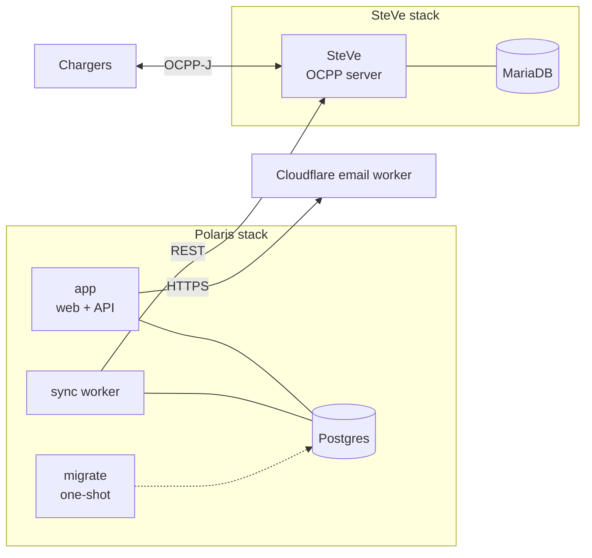

import Glossary from "@components/Glossary.astro";

Polaris Express is a small constellation of services rather than a single monolith. If you're going to run it yourself, it helps to know what each piece does, what talks to what, and where state lives — before you start editing compose files.

## The model

A Polaris Express deployment is two stacks running side by side: the **Polaris stack** (the web app, sync worker, and its Postgres) and the **<Glossary term="<Glossary term="SteVe">SteVe</Glossary>">SteVe</Glossary> stack** (the <Glossary term="<Glossary term="OCPP">OCPP</Glossary>">OCPP</Glossary> server and its MariaDB). They are deliberately separate so that the OCPP server can be restarted, upgraded, or replaced without touching application state.

### The Polaris stack

Defined in the root `docker-compose.yml`. Four services, one volume:

- **`postgres`** — Postgres 17. Source of truth for users, ChargeBoxes, <Glossary term="<Glossary term="EV card">EV card</Glossary>">EV cards</Glossary>, idTags, tariffs, <Glossary term="<Glossary term="Sync run">Sync run</Glossary>">sync runs</Glossary>, and the audit log. The named volume `postgres_data` is the only piece of state Polaris itself owns.
- **`migrate`** — a one-shot container that runs `deno task db:migrate` and exits. Other services wait on it via `service_completed_successfully` so the schema is always current before anything tries to read it.
- **`app`** — the Deno web app. Serves the dashboard, the public booking surfaces, the API, and the <Glossary term="<Glossary term="Kiosk mode">Kiosk mode</Glossary>">kiosk</Glossary> views. Mounts the Docker socket so it can introspect the stack from within. Exposed on port 8000.
- **`sync`** — a long-running Deno process (`sync-worker.ts`) that reconciles state between Polaris and SteVe. ChargeBoxes, idTags, and <Glossary term="<Glossary term="Reservation">Reservation</Glossary>">reservations</Glossary> created in Polaris become OCPP entities in SteVe via this worker; transactions and <Glossary term="<Glossary term="Meter value">Meter value</Glossary>">meter values</Glossary> flow back.

All four containers share `web/.env`, so credentials and DB URLs only have to be defined once.

### The SteVe stack

Defined in `steve/docker-compose.yml`. Two services, one external network:

- **`mariadb`** — MariaDB 10.4. Holds SteVe's own data: <Glossary term="<Glossary term="ChargeBox">ChargeBox</Glossary>">charge box</Glossary> registrations, OCPP idTags, transactions, meter values. Bind-mounted to `/data/ocpp/mariadb` on the host.
- **`app`** — SteVe itself. Speaks OCPP-J (WebSocket) to chargers on its public endpoint and exposes a REST/SOAP API that the Polaris sync worker drives.

SteVe lives on two Docker networks: an internal `ocpp` network (for MariaDB) and an external `pangolin` network used by the reverse proxy that fronts the OCPP WebSocket.

### What's not in compose

- **The email worker** is a Cloudflare Worker, not a container. In production it runs on Cloudflare; in development you run `npx wrangler dev` from `email-worker/` and point `CF_EMAIL_WORKER_URL` at the wrangler URL.
- **TLS termination and routing** are external — typically Pangolin or another reverse proxy. The compose files expose ports; they don't terminate certificates.

## Why it works this way

**Two databases, on purpose.** Polaris owns application state (who can charge, what they're billed, what's reserved). SteVe owns protocol state (what charger is online, what transaction is in flight). Keeping them in separate engines makes the trust boundary obvious: SteVe is replaceable, Polaris is not. The sync worker is the only component that knows both schemas.

**A dedicated sync worker, not in-process sync.** Pushing OCPP changes is bursty and occasionally slow — SteVe's REST API isn't designed for high concurrency. Running the reconciler in its own container means request handlers in `app` never block on SteVe, and sync failures don't take the dashboard down. Sync runs are recorded in Postgres so operators can see what happened.

**Migrations as a one-shot service.** Running `db:migrate` as a separate container that `app` and `sync` depend on guarantees there's never a race between two long-running services trying to apply migrations on startup. It also means a botched migration fails loudly and visibly, instead of putting one replica into a half-migrated state.

**Docker socket mounted into `app`.** The web app surfaces stack health to operators (which containers are up, recent logs). Mounting the socket is the simplest way to do this on a single-host deployment. If you split the stack across hosts you'll want to replace that with a real orchestrator API.

## What this means for you

If you're operating a self-hosted instance:

- **Back up two things.** The `postgres_data` Docker volume and the `/data/ocpp/mariadb` bind mount. Backing up only one will leave you with mismatched state on restore.
- **Restart order matters less than you'd think.** `migrate` gates `app` and `sync`; healthchecks gate `migrate`. You can `docker compose up -d` and let dependencies sort themselves out. The SteVe stack is fully independent — restart it on its own schedule.
- **The sync worker is the canary.** If ChargeBoxes you create in the dashboard aren't appearing in SteVe, the worker is the first place to look. Its logs (and the sync runs table in Postgres) will tell you whether it's running and whether SteVe is responding.
- **Two `.env` files, not one.** The Polaris stack reads `web/.env`; SteVe reads `docker-compose.mariadb.env` and `docker-compose.app.env`. Don't try to unify them — the credentials inside aren't supposed to be shared.
- **The email worker is out-of-band.** A working Polaris stack with no email worker configured will silently fail to send magic links. Verify `CF_EMAIL_WORKER_URL` is set and reachable from inside the `app` container.

## Related

- [Install the self-hosted stack](/selfhost/install/)
- [Back up and restore](/selfhost/backup-restore/)
- [Sync runs explained](/concepts/sync-runs/)
- [Running the email worker locally](/selfhost/email-worker-dev/)