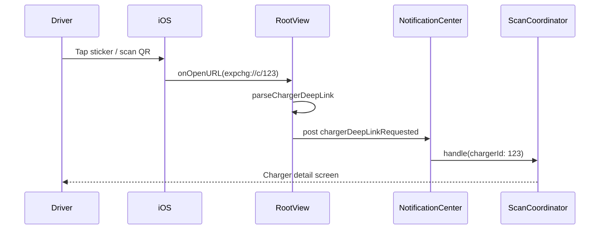

import Glossary from "@components/Glossary.astro";

import { Aside } from '@astrojs/starlight/components';

A driver tapping a sticker on the side of a charger should land
directly on that charger inside ExpresScan — no manual ID entry, no
hunting through a list. This article explains how the app turns a URL
into an in-app action, what URL shapes are accepted, and why the
indirection through `NotificationCenter` exists.

## The model

ExpresScan listens for two kinds of URLs:

1. **Universal Links** — `https://<host>/...` URLs that iOS routes to
   the app when the matching AASA file is published. These work from
   Safari, Messages, Mail, and the camera viewfinder.
2. **Custom scheme** — `expchg://...` URLs. Useful for printed
   stickers and QR codes where a Universal Link would resolve in the
   browser if the app isn't installed, and as a deterministic fallback
   when AASA hasn't yet propagated to a device.

Both end up at the same place: `RootView`'s `onOpenURL` (or
`onContinueUserActivity` for legacy Universal Link delivery). The
handler parses the URL into one of four intents, posts a
[deep link](/glossary#deep-link) notification, and lets the appropriate
subsystem respond.

### URL shapes

| Intent | Universal | Custom scheme |
|---|---|---|
| Open a [<Glossary term="<Glossary term="ChargeBox">ChargeBox</Glossary>">ChargeBox</Glossary>](/glossary#chargebox) | `https://<host>/c/<id>` | `expchg://c/<id>` |
| User QR sign-in | `https://<host>/u/<publicId>` | — |
| [<Glossary term="<Glossary term="Magic link">Magic link</Glossary>">Magic link</Glossary>](/glossary#magic-link) sign-in | `https://<host>/m/<token>` | — |
| Registration PKCE callback | `https://<host>/<callback>?code=…` | — |

The charger intent (`/c/<id>`) is the only one that uses the custom
scheme today. Sign-in URLs are Universal-Link-only by design: they
must be hard for a malicious sticker to spoof, so they require AASA
domain ownership.

### Flow

The same diagram applies to `/u/<publicId>` and `/m/<token>`, except
the receiver is the auth pipeline rather than the
[scan](/glossary#expre-scan) coordinator, and the app must currently
be in an unauthenticated state for the notification to fire.

## Why it works this way

**Two URL channels, one parser.** Universal Links land in
`onOpenURL` on iOS 18+ and in `onContinueUserActivity` on older
delivery paths. `RootView` hooks both and routes them through a single
`handleUniversalLink(_:)` so the parsing rules stay in one place.

**`NotificationCenter` as a bus.** Parsing happens in `RootView`
because that's where the URL arrives, but the handlers
([ScanCoordinator](/glossary#expre-scan), the QR sign-in view model,
the magic-email view model) live in feature modules. Posting a
notification keeps `RootView` decoupled from those modules and lets us
test parsing without standing up the entire app graph.

**Custom scheme is a fallback, not the canonical form.** Universal
Links degrade gracefully — if ExpresScan isn't installed, the
`https://` link opens a web page that tells the driver where to get
the app. `expchg://` URLs just fail. Stickers therefore print the
Universal Link as the QR payload; the custom scheme exists for
operator tooling and edge cases where AASA hasn't propagated.

**Auth-state gating for sign-in URLs.** A `/u/<publicId>` URL
delivered while the driver is already signed in is a no-op: re-running
the QR sign-in would clobber the active session. `RootView` only
forwards sign-in notifications when the route is `.welcome`,
`.loggingIn`, `.launching`, or `.customerSigningIn`. Charger
deep links, by contrast, are always honored — they're navigation, not
authentication.

## What this means for you

- **You can share a charger with another driver** by long-pressing
  the charger ID in the app and copying the link. The recipient taps
  the link and lands on the same charger.
- **Stickers are tap-to-open.** You don't need to launch ExpresScan
  first; tapping the NFC area or scanning the QR with the system
  camera opens the app directly to that charger.
- **If a link doesn't open the app**, AASA hasn't propagated to your
  device yet. Force-quitting and re-opening ExpresScan, or installing
  it fresh, resolves it. The `expchg://` form on the same sticker
  always works as a fallback.
- **Magic links and QR sign-in URLs only work when you're signed out.**
  This is intentional — if you've already got a session, the URL is
  ignored rather than overwriting it.

## Related

- [Sign in with a QR code](/user/ios/auth/qr-sign-in/)
- [Sign in with a magic email link](/user/ios/auth/magic-email/)
- [Charger stickers and AASA setup](/operator/web/chargers/stickers/)
- [Registration PKCE callback](/dev/ios/auth/registration-pkce/)