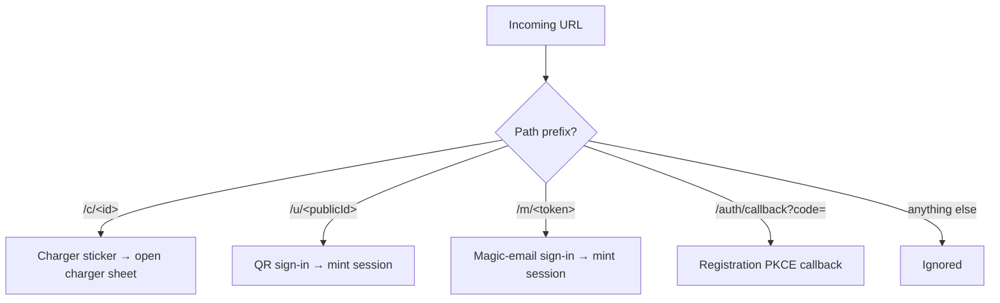
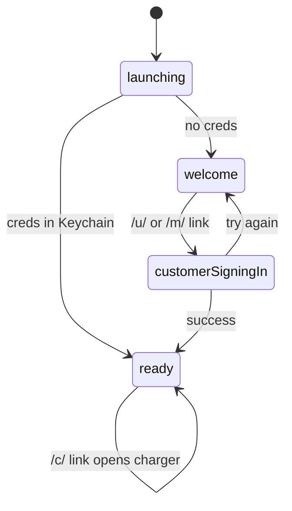

When you tap a Polaris Express link in Safari, Mail, or a Messages
thread — or scan a sticker with the system Camera — iOS hands the
URL straight to the ExpresScan app instead of opening a browser tab.
This concept article explains the routing model behind that behaviour:
which URLs the app claims, how they map to in-app actions, and what
happens when a link arrives while you're already signed in (or not
signed in at all).

## The model

A Deep link is a URL that iOS recognises as belonging to ExpresScan.
The app advertises two ways of receiving these URLs:

- **Universal Links** — `https://` URLs declared in the app's
  `apple-app-site-association` (AASA) file. iOS routes them to
  ExpresScan when installed; otherwise the URL opens in Safari.
- **Custom-scheme URLs** — e.g. `expchg://c/&lt;id&gt;`. These only work
  when the app is installed, but they survive contexts where Universal
  Links don't (some in-app browsers, QR scanners that strip `https`).

Both delivery paths converge on a single handler in `RootView`. The
handler inspects the URL's path prefix and routes it to one of four
flows:

Each prefix corresponds to a specific surface:

| Prefix | Purpose | Audience |
| --- | --- | --- |
| `/c/&lt;id&gt;` | Open a charger from its physical sticker | Anyone with the app |
| `/u/<publicId>` | Sign in via the QR code on an EV card | Customers |
| `/m/&lt;token&gt;` | Sign in via a Magic link emailed to a customer | Customers |
| `/auth/callback` | Complete operator/developer registration (PKCE) | Operators |

### Delivery paths

iOS delivers Universal Links to the app through two SwiftUI hooks,
and ExpresScan listens on both:

- `onOpenURL` — modern unified delivery (iOS 18+) and the custom
  scheme.
- `onContinueUserActivity(NSUserActivityTypeBrowsingWeb)` — legacy
  channel still used in some launch contexts.

Both call the same parser, so a `/u/abc123` link reaches the same code
whether it arrived from the Camera app, a tapped link in Mail, or a
push notification's tap-action.

### Auth-gate awareness

The router doesn't act on a sign-in link if you're already signed in.
When a `/u/` or `/m/` URL arrives, ExpresScan checks the current
`RootRoute`:

Sign-in links are only consumed from `welcome`, `loggingIn`,
`launching`, or `customerSigningIn`. From `ready` they're ignored —
the user is already authenticated, and re-running the sign-in flow
would destroy the live session.

Charger deep links (`/c/`) work from any state, because opening a
charger sheet is safe regardless of who's signed in.

## Why it works this way

**One handler, many surfaces.** Polaris Express prints URLs on
physical stickers, EV cards, and inside emails. Funnelling them all
through one parser means the same `https://example.com/u/abc123` URL
works the same way whether it's scanned, tapped, or pasted.

**Universal Links over custom schemes.** A custom-scheme URL in a
browser shows a scary "Open in ExpresScan?" prompt, and silently fails
when the app isn't installed. A Universal Link degrades gracefully:
no app → Safari opens the URL → the web surface shows a download
prompt. ExpresScan keeps the custom scheme (`expchg://`) for QR-code
contexts where `https` would be redirected by an in-app browser
before iOS gets a chance to claim it.

**Route-aware consumption.** Sign-in URLs are powerful — they mint a
new session and rebind the device's OCPP tag. Letting one fire while
a user is signed in would silently swap the active account. Gating on
`RootRoute` is the cheapest correctness guarantee.

**Notification-based dispatch.** The handler posts an
`NSNotification` instead of mutating the coordinator directly. This
keeps the URL parser free of business logic, and lets the
sign-in view models react in their own time (showing the phased
`CustomerSignInProgressView` between `welcome` and `ready`).

## What this means for you

As a driver:

- **Scanning a charger sticker** with your Camera opens that charger
  in ExpresScan — no need to find it in the list first.
- **Scanning the QR on your EV card** signs you in on this device. If
  you were already signed in as someone else, the scan does nothing;
  sign out first.
- **Tapping a Magic link** from a Polaris Express email signs you in
  the same way. The link is single-use and expires server-side.
- **Links don't work?** Make sure ExpresScan is installed and you've
  opened it at least once — iOS only fetches the AASA file after
  first launch. If the link opens in Safari instead of the app, long-
  press it and pick "Open in ExpresScan".

## Related

- [Sign in with your EV card](/user/ios/sign-in/qr-card/)
- [Sign in via email magic link](/user/ios/sign-in/magic-email/)
- [Open a charger from its sticker](/user/ios/charging/sticker-scan/)
- [Universal Links and AASA hosting](/selfhoster/web/universal-links/)