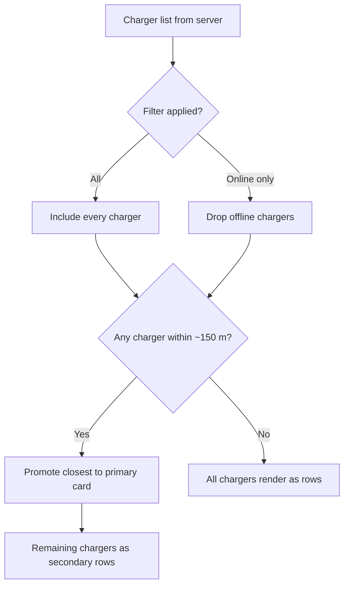

The Chargers tab in [expreScan](/glossary#expre-scan) is the driver's
at-a-glance view of every unit they can use. Before you tap into a
specific charger, the list itself tells you which ones are reachable,
which one is closest to you, and which are filtered out of view. This
article explains what those indicators mean and how the app decides
what to show.

## The model

The Chargers tab combines three independent signals — **reachability**,
**proximity**, and **filter state** — into a single ordered list.

### Reachability

Each entry carries an online state derived from its [OCPP](/glossary#ocpp)
connection to [SteVe](/glossary#steve). A charger is *online* when SteVe
has an active websocket from it; otherwise it's *offline*. The list row
shows this as a status dot and label. Offline chargers can still be
opened — the detail screen will show their last known state — but they
won't respond to a start request until they reconnect.

### Proximity

When the app has location permission, it streams the device's location
while the Chargers tab is visible. If any charger is within roughly
**150 m**, the closest one is promoted into a tall **primary card** at
the top of the list, with a distance readout. Everything else falls
into the standard row list below it.

If no charger is nearby, or if location permission is denied, every
charger renders as a regular row and no primary card appears. Distance
labels still show on rows when a location fix is available.

### Filter state

The toolbar filter menu lets you narrow the list to **online chargers
only** or show **all chargers**. The filter is applied before
proximity promotion, so the primary card is always chosen from the
chargers you can currently see.

### The single-charger fast path

If — after filtering — the list contains exactly one charger, the app
pushes its detail screen automatically the first time it resolves.
Tap back and you return to the list (which will not auto-push again
in the same session), so the behavior gracefully gives way as more
chargers appear in your fleet.

## Why it works this way

A driver standing in front of a charger doesn't want to scan a list —
they want the unit in front of them to be obvious. Proximity promotion
solves that without forcing the driver to scan a sticker: when you
walk up to a charger, it floats to the top on its own.

Reachability is surfaced honestly rather than hidden. An offline
charger is still listed because the cause is often transient (network
blip, reboot), and the driver may want to open the detail screen to
see the last reading or trigger a refresh. Filtering it out by default
would hide useful state; offering an "online only" filter lets drivers
opt into a cleaner view when they want one.

Location updates start only when the Chargers tab is on screen, and
stop when you leave it. That keeps the iOS status-bar location
indicator honest — the app is only "using your location" when it's
actively ranking chargers by distance.

## What this means for you

- **A tall card at the top** means you're within ~150 m of that
  charger. It's the closest one to you right now.
- **A green status dot** means the charger is connected to SteVe and
  can accept a start request. A grey or red dot means it's offline;
  open it to see when it was last seen.
- **No primary card** means either you're not near any charger, or
  the app doesn't have a location fix yet. Pull to refresh, or grant
  location permission in Settings.
- **A list of one** pushes you straight into the detail screen on
  first load. Tap back to see the list.
- **The filter menu** in the top-right toolbar lets you hide offline
  chargers without losing them — flip back to "All" to see them again.

## Related

- [Find a charger near you](/user/ios/find/nearby-charger)
- [Scan a sticker to open a charger](/user/ios/find/scan-sticker)
- [Why is a charger showing as offline?](/user/ios/troubleshoot/offline-charger)
- [OCPP](/glossary#ocpp) and [SteVe](/glossary#steve) in the glossary