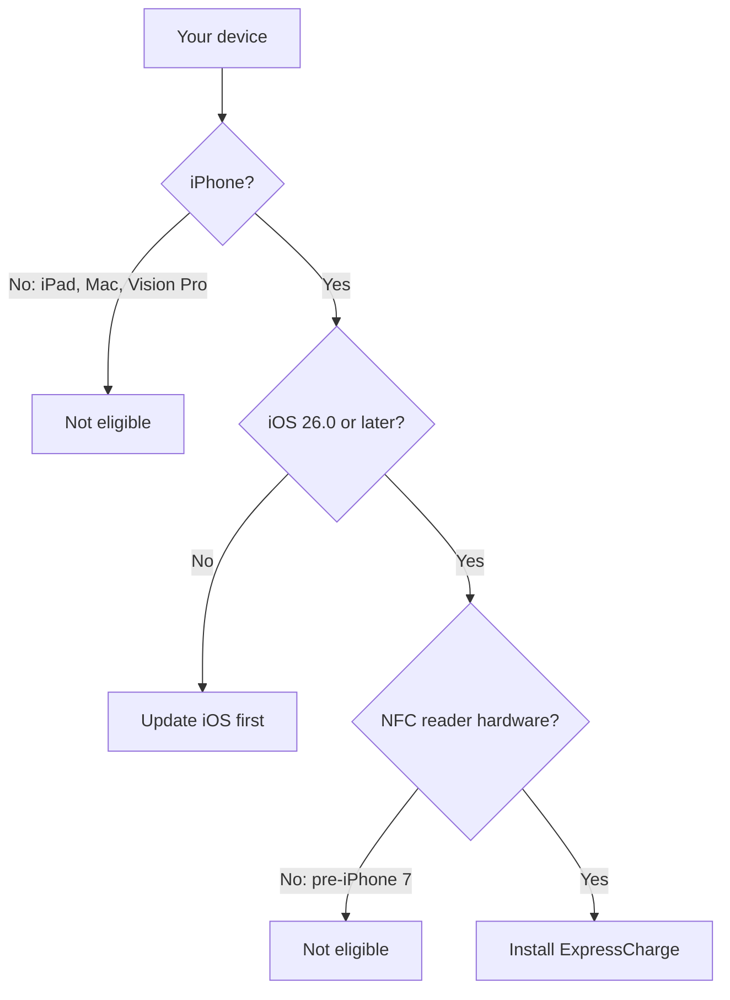

ExpressCharge is an iPhone-only app that uses NFC to read your charge card and start sessions at participating chargers. Before you install, it's worth understanding what the app needs from your device — and what it deliberately does not need — so you know whether it will run, what permissions it will ask for, and why.

## The model

ExpressCharge is a single-platform, single-orientation, NFC-dependent app. Three properties of your iPhone determine whether the App Store will even offer you the download:

### The hard requirements

| Requirement | Value | Why |
|---|---|---|
| Device family | iPhone only | The app is built and signed for `TARGETED_DEVICE_FAMILY = 1`. iPad, Mac (Apple silicon), and Apple Vision Pro listings are explicitly disabled. |
| Operating system | iOS 26.0 or later | The deployment target is `iOS 26.0`. Older iPhones running iOS 25 or earlier will not see the app in the App Store. |
| Hardware capability | NFC tag reading | The Info.plist declares `nfc` under `UIRequiredDeviceCapabilities`. iPhones without an NFC reader cannot install the app. |
| CPU architecture | arm64 | Also declared as a required capability. Every NFC-capable iPhone meets this. |
| Orientation | Portrait only | The app is portrait-locked and runs full-screen. |

### Runtime permissions

Two iOS permission prompts appear the first time they're needed. Neither is requested at launch:

- **NFC** — required to read your charge card. The system prompt appears the first time you tap *Scan card*. The reason string shown is: *"ExpressCharge reads the unique ID from your NFC charge card so the charging station can verify your account and start your session."*
- **Location (When In Use)** — optional. Used only to sort the charger list by distance. If you decline, the app still works; the list is simply not distance-sorted. The reason string is explicit: *"Your location stays on your device — we never receive or store it."*

Push notifications are enabled silently in the background (the app uses the `remote-notification` background mode for session status updates). Apple does not show a separate prompt for silent push.

## Why it works this way

**iPhone-only is a hardware decision, not a marketing one.** ExpressCharge's primary user gesture is "tap your charge card against your phone." That gesture only works on devices with a Core NFC reader positioned at the top of the device — iPhone 7 and later. iPads have no NFC reader. Macs and Vision Pro can run iPhone apps via Apple silicon, but presenting the app there would be misleading: the central feature would not function. Restricting `TARGETED_DEVICE_FAMILY` to iPhone and listing `nfc` as a required capability lets the App Store filter the app out of incompatible storefronts before a user ever tries to install it.

**iOS 26 is the floor because the app is built against the iOS 26 SDK with Swift 6.3 strict concurrency.** This isn't a feature flag we can lower; the binary literally will not load on earlier iOS releases. Holding the floor high lets us use modern Swift concurrency features without runtime fallbacks.

**Portrait-only and full-screen** reflect the scanning use case. You hold the phone vertically against the card — there is no productive use of landscape, and the App Store rules around iPad orientation support are simplified by declaring full-screen-only.

## What this means for you

- **If you have an iPhone 7 or newer running iOS 26 or later:** you're good. Install from the App Store as normal.
- **If your iPhone is older than iPhone 7:** the app cannot work on your device — there is no NFC hardware to read your card.
- **If you're on iOS 25 or earlier:** update iOS first. The App Store will not offer the download until you do.
- **If you use an iPad, Mac, or Vision Pro:** ExpressCharge is not available on these platforms and will not be listed in their App Stores. Use your iPhone.
- **About permissions:** you will be asked to allow NFC the first time you scan a card. Location is optional and only improves the charger list. The app does not transmit your location anywhere.

## Related

- [Installing ExpressCharge on your iPhone](/docs/user/ios/install/install/)
- [Registering your charge card](/docs/user/ios/register/register-card/)
- [Troubleshooting NFC scans](/docs/user/ios/troubleshoot/nfc/)