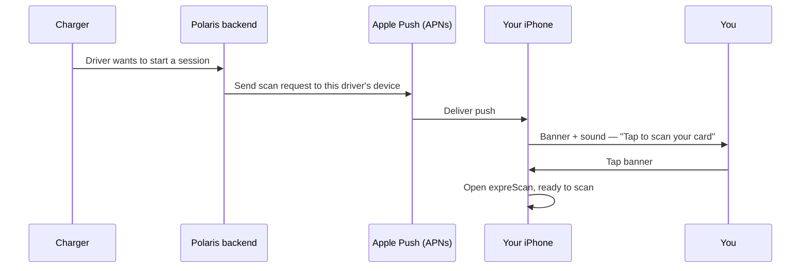

expreScan uses push notifications sparingly. The app only asks you to
do one thing through a notification — scan a card — and it only sends
that prompt when something on the other end of the system is actually
waiting on you. This article explains what you'll see, why it shows
up, and what your phone does behind the scenes.

## The model

There is exactly **one kind of notification** the app delivers today:
a **scan request**. Everything else you might see on your lock screen
from expreScan is iOS plumbing around that single category.

The notification is **tap-to-act**. There are no buttons on the
banner, no "Approve" or "Decline" choices — just the prompt itself.
Tapping it opens expreScan with the scan screen ready to go.

### What the notification looks like

| Where you are | What you see |
| --- | --- |
| Phone locked | Banner on lock screen with sound |
| Phone unlocked, app closed | Banner at top of screen with sound |
| Already inside expreScan | Brief banner — the in-app prompt is the real UI |

The app does **not** add a number badge to its icon and does **not**
leave entries piling up in Notification Center. A scan request is
either acted on now or it has already expired.

## Why it works this way

A scan request represents a live, time-sensitive moment: someone (or
something) is at a charger waiting for authorization. Treating it
like email — letting it queue up, adding badge counts, offering
"snooze" or "ignore" actions — would imply you can deal with it
later. You can't. By the time you're looking at an old scan request,
it's no longer valid.

That's also why the app only ever registers a **single notification
category** with iOS. More categories would mean more types of
prompts, and more types of prompts would dilute the meaning of the
one that matters.

The app **never** sends:

- Marketing or promotional pushes.
- "Your session is complete" receipts (those live in your account
  history, not as notifications).
- Background pings to keep the app alive. expreScan does not wake
  itself up in the background.

## What this means for you

**Trust the banner.** If expreScan sends you a notification, something
is genuinely waiting on you. Tapping it is the fastest path to
unblock whatever's happening.

**You won't miss anything by clearing notifications.** Scan requests
are short-lived. If you swipe one away and it was still valid, you
can usually just trigger the scan again from the app itself. If it
wasn't valid anymore, you saved yourself a tap.

**Permission matters.** expreScan asks for notification permission
during onboarding. If you declined and want to re-enable it, go to
**Settings → expreScan → Notifications** on your iPhone and turn on
**Allow Notifications**. Without permission, the app falls back to
asking you to keep it open when a scan is expected — which works, but
is less convenient.

**Battery and data are not a concern.** Because there's only one
notification type and the app does no background polling, expreScan
costs essentially nothing when you're not using it.

## Related

- [Set up notifications on your iPhone](/user/ios/notifications/setup/)
- [What to do when a scan request arrives](/user/ios/scanning/respond-to-scan-request/)
- [Troubleshooting: I'm not receiving notifications](/user/ios/troubleshooting/no-notifications/)