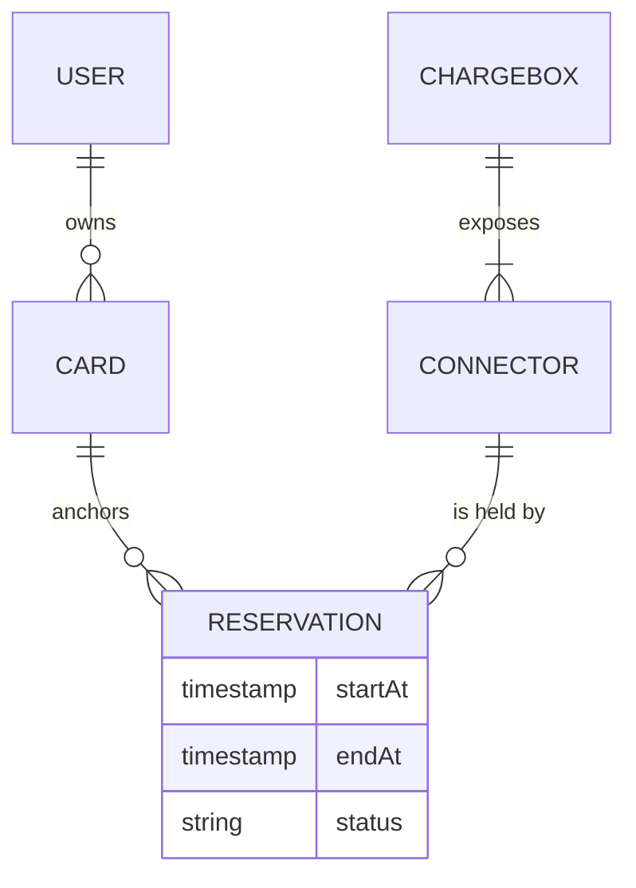
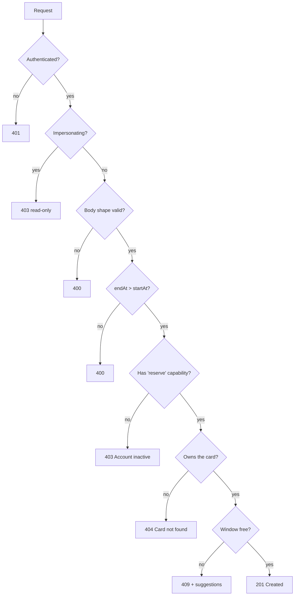

import Glossary from "@components/Glossary.astro";

A [<Glossary term="<Glossary term="Reservation">Reservation</Glossary>">Reservation</Glossary>](/glossary/#reservation) holds a specific [<Glossary term="<Glossary term="Connector">Connector</Glossary>">Connector</Glossary>](/glossary/#connector) on a specific [<Glossary term="<Glossary term="ChargeBox">ChargeBox</Glossary>">ChargeBox</Glossary>](/glossary/#chargebox) for a window of time, tied to one of your [<Glossary term="<Glossary term="EV card">EV card</Glossary>">EV cards</Glossary>](/glossary/#ev-card). Understanding what the system enforces — and what it doesn't — helps you read 4xx responses and the suggestion chips that appear when your first choice is taken.

## The model

A reservation is the tuple `(chargeBox, connector, card, startAt, endAt)`. Every reservation is owned by exactly one card; the card determines who can see it and which [<Glossary term="<Glossary term="Lago">Lago</Glossary>">Lago</Glossary> subscription](/glossary/#lago-subscription) the eventual session bills against.



Two rules govern the lifecycle of every reservation request:

1. **Scope.** You can only see and create reservations against cards you own. The customer API filters all reads by `scope.ocppTagPks` and, on writes, calls `assertOwnership("card", …)` before doing anything else. If you reference a card that isn't yours, the response is `404 Card not found` — by design, ownership failures and missing rows look identical.
2. **<Glossary term="<Glossary term="Capability">Capability</Glossary>">Capability</Glossary>.** Creating a reservation requires the `reserve` [Capability](/glossary/#capability). Drivers whose accounts are inactive get `403 Account inactive` with the capability name attached, regardless of whether the requested window is free.

### Validation order

The POST handler applies checks in a fixed order. Knowing the order tells you which problem the API is complaining about first:



There is no minimum or maximum duration enforced at this layer beyond `endAt > startAt`. Practical limits come from the [<Glossary term="<Glossary term="Tariff">Tariff</Glossary>">Tariff</Glossary>](/glossary/#tariff) and from how long the [ChargeBox](/glossary/#chargebox) will actually hold an [<Glossary term="<Glossary term="OCPP">OCPP</Glossary>">OCPP</Glossary>](/glossary/#ocpp) reservation — both of which can shorten what you booked, but neither will prevent the booking itself.

### Conflicts and suggestions

When the requested window overlaps any existing reservation on the same `(chargeBox, connector)`, the API responds with `409` and a structured body:

```json
{
  "error": "Time window conflicts with existing reservation(s)",
  "conflicts": [ /* the blocking reservations */ ],
  "suggestions": [ /* up to 2 alternative windows */ ]
}
```

`suggestions` are computed by `suggestAlternatives`. They have two properties worth knowing:

- **Same duration.** Each suggestion is exactly as long as the window you asked for.
- **After the conflicts.** Suggestions are free windows that start *after* the conflicting reservations end. The algorithm doesn't look backwards.

At most two suggestions are returned. The web UI renders them as one-tap chips so accepting an alternative is a single click.

### Listing rules

`GET /api/customer/reservations` follows the same scoping rule and accepts three optional filters:

- `status=` — a comma-separated subset of the canonical statuses. An unknown status returns `400` with the allowed list.
- `upcoming=true` — restricts to reservations whose `endAt` is in the future and sorts ascending by `startAt`. Otherwise the list is sorted descending (newest first).
- `limit` / `skip` — paginated; `limit` is clamped to `[1, 500]` and defaults to `50`.

If your scope contains no cards, the endpoint short-circuits to an empty list rather than running a query — so a brand-new account with no provisioned cards is indistinguishable from one with cards but no reservations.

## Why it works this way

**Cards are the unit of ownership.** Routing scope through [<Glossary term="<Glossary term="idTag">idTag</Glossary>">idTag</Glossary>](/glossary/#idtag) primary keys (rather than user IDs) means the same checks work for shared cards, multi-user fleets, and future cases where one human holds cards across multiple tenants. The customer API never asks "is this your reservation?" — it asks "is this your card?" and the reservation follows.

**Ownership errors masquerade as 404s.** Returning `404 Card not found` for both missing and unauthorized cards prevents the API from being used as an enumeration oracle.

**<Glossary term="<Glossary term="Impersonation">Impersonation</Glossary>">Impersonation</Glossary> is read-only.** An operator using [Impersonation](/glossary/#impersonation) can browse a customer's reservations to help them troubleshoot, but cannot create one on their behalf. Mutations under an impersonated session return `403`. Operators who need to book on behalf of a driver use admin tools, which carry their own [audit log](/glossary/#audit-log) trail.

**Suggestions only look forward.** The intent is "you missed this slot; here's the next one and the one after." Backward search would surface windows that are technically free but probably useless (the user already chose a time for a reason).

## What this means for you

As a driver:

- A `404` on a card you swear you own usually means the card is provisioned to a different account, not that it's been deleted.
- A `403 Account inactive` is independent of the time you picked — fixing the window won't help; resolve the account state first.
- A `409` is not a dead end. Check `suggestions` before retrying with a fresh window of your own.
- You can't create reservations on behalf of someone else, even if you have their card's primary key. The card must be in your scope.

## Related

- [Tutorial: Book a reservation from the driver web app](/user/web/reservations/book-a-reservation/)
- [Runbook: A driver says their reservation "disappeared"](/operator/runbooks/missing-reservation/)
- [Concept: How EV cards map to OCPP tags](/user/web/cards/cards-and-ocpp-tags/)
- [Reference: Customer reservations API](/developer/api/customer-reservations/)