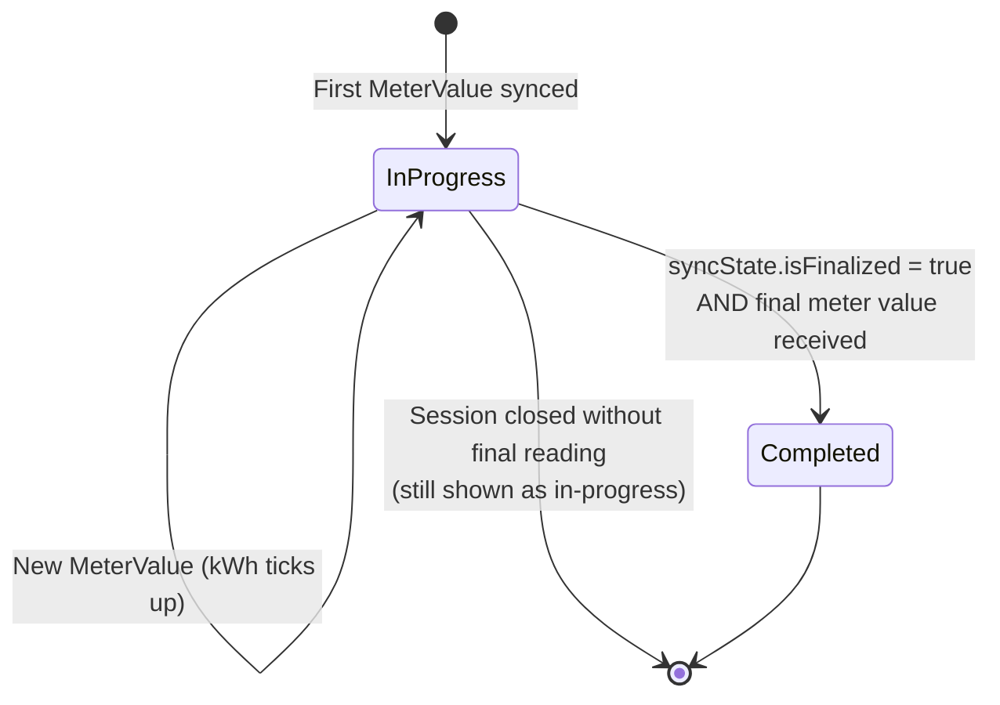
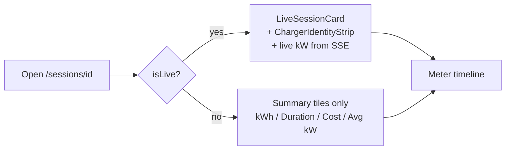

When you open a session in Polaris Express, the badge at the top of the
page tells you where that charge sits in its life cycle. The status is
not a free-form label — it's derived from two signals: whether the
session has been **finalized** on the back end, and whether its final
**meter reading** has been received. Understanding the model makes it
easier to tell a normal in-progress charge from one that needs
attention.

## The model

A session in Polaris Express is anchored to a SteVe transaction. As you
charge, SteVe emits MeterValues, Polaris syncs them as
`syncedTransactionEvents`, and a sibling `transactionSyncState` row
tracks whether SteVe has marked the transaction as closed.

The status badge on `/sessions/[id]` is computed from those two rows:

Two flags drive the badge:

| Flag | Source | Meaning |
| --- | --- | --- |
| `isLive` | `transactionSyncState.isFinalized` is `false` | SteVe still considers the transaction active. |
| `isFinal` | The latest event row has `isFinal = true` | The final MeterValue has been recorded. |

The rendered status follows a simple rule:

- `isLive` → **In progress**
- not live and `isFinal` → **Completed**
- not live and not `isFinal` → still rendered as **In progress** until the final reading lands

That last case is the important one. A session only flips to
**Completed** once both the closing signal and the closing meter
reading have been reconciled.

### What each status surfaces

The status doesn't just change a badge — it changes what the page
shows.

For live sessions, Polaris also makes a best-effort call to SteVe to
fetch the ChargeBox, connector, and start timestamp so the LiveSessionCard can render. If
that call fails, the rest of the page still renders — you just won't
see the live charger strip.

## Why it works this way

Two design choices fall out of this model:

**Status is derived, not stored.** There is no `status` column on a
session. The badge is computed at request time from the underlying
sync state. That means a session can transition from "In progress" to
"Completed" simply because a final MeterValue arrived — without any
write to the session row itself. It also means a stale sync state
can't lie about whether a session is really done.

**404, not 403, on sessions you don't own.** The loader runs
`assertOwnership` before reading anything else, and any ownership
failure returns `Not Found`. This prevents enumeration of session IDs
that belong to other drivers.

**Estimated cost is computed per-event.** A session that straddles two
billing periods, or crosses a tier boundary on a tiered plan, would
report the wrong cost if Polaris just multiplied total kWh by a single
rate. Instead, each event is priced against the period and tier it
falls into, then summed. The result carries a `coverage` flag:

- **`included`** — the session is covered by your subscription
- **`billed`** — the session will appear on your invoice
- **`unknown`** — pricing could not be resolved (rare; usually a
  tariff lookup failure)

## What this means for you

- A session that says **In progress** but hasn't ticked up in a while
  is most likely waiting for SteVe to send its final MeterValue. The
  badge will flip once that lands — you don't need to refresh
  aggressively.
- The live tile (kW, elapsed time) only renders while `isLive` is
  true. Once the session completes, you'll see the summary tiles
  instead, with the final totals.
- Cost shown on a live session is an estimate based on kWh synced so
  far. The number on your invoice is the source of truth.
- If you opened a session URL and got a "Not Found" page, the session
  either doesn't exist or isn't linked to one of your EV cards.

## Related

- [View your sessions](/user/web/sessions/list-sessions/)
- [How tariffs price your charging](/concepts/tariffs/)
- [Reading the meter timeline](/user/web/sessions/read-meter-timeline/)
- [What a session looks like in your invoice](/user/web/billing/read-invoice/)