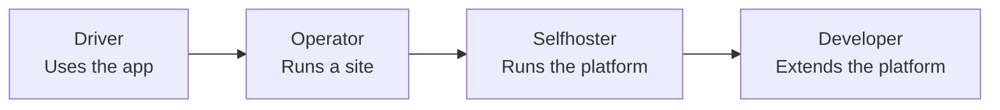

import Glossary from "@components/Glossary.astro";

Polaris Express is a charging platform that serves three very different
audiences from the same codebase: drivers who plug in, operators who
run sites, and developers who extend the system. This page helps you
pick the docs that match what you're actually trying to do.

## The model

Polaris Express has three concentric audiences, each with progressively
deeper access to the system:

Each role inherits context from the ones before it. An operator is
also a driver. A selfhoster is also an operator. A developer usually
plays all four hats at some point.

### Drivers

If you arrived here because you want to charge an EV, you're a
driver. The driver docs cover the [<Glossary term="<Glossary term="<Glossary term="EV card">EV card</Glossary>">EV card</Glossary>">EV card</Glossary>](/glossary#ev-card) you
tap or scan at a charger, the mobile app, and what to do when
something goes wrong mid-session.

### Operators

Operators manage one or more sites: chargers, [tariffs](/glossary#tariff),
[<Glossary term="<Glossary term="<Glossary term="Reservation">Reservation</Glossary>">Reservation</Glossary>">reservations</Glossary>](/glossary#reservation), and the people allowed to use
them. The operator docs explain the admin console — how charger
state flows from [<Glossary term="<Glossary term="<Glossary term="OCPP">OCPP</Glossary>">OCPP</Glossary>">OCPP</Glossary>](/glossary#ocpp) through [<Glossary term="<Glossary term="<Glossary term="SteVe">SteVe</Glossary>">SteVe</Glossary>">SteVe</Glossary>](/glossary#steve)
into Polaris, how [<Glossary term="<Glossary term="<Glossary term="User mapping">User mapping</Glossary>">User mapping</Glossary>">user mappings</Glossary>](/glossary#user-mapping) link drivers
to [<Glossary term="<Glossary term="<Glossary term="Lago">Lago</Glossary>">Lago</Glossary>">Lago</Glossary> customers](/glossary#lago-customer) for billing, and how to
interpret the [audit log](/glossary#audit-log).

### Selfhosters

If you're running your own Polaris Express instance, the selfhoster
docs cover deployment topology, secrets, the [SteVe](/glossary#steve)
integration, [<Glossary term="<Glossary term="<Glossary term="BetterAuth">BetterAuth</Glossary>">BetterAuth</Glossary>">BetterAuth</Glossary>](/glossary#betterauth) configuration, and
[Lago](/glossary#lago) wiring.

### Developers

The developer docs are reference material: the API surface, webhook
contracts, [feature flag](/glossary#feature-flag) plumbing, and the
internal subsystems like [<Glossary term="<Glossary term="<Glossary term="Adaptive Cadence">Adaptive Cadence</Glossary>">Adaptive Cadence</Glossary>">Adaptive Cadence</Glossary>](/glossary#adaptive-cadence)
and [<Glossary term="<Glossary term="<Glossary term="expreScan">expreScan</Glossary>">expreScan</Glossary>">expreScan</Glossary>](/glossary#expre-scan).

## Why it works this way

Splitting docs by persona rather than by feature avoids two failure
modes we kept hitting:

1. **Feature-organized docs bury the task.** A driver looking for
   "why didn't my card work" shouldn't have to read about OCPP
   [idTags](/glossary#idtag) and [pre-authorization](/glossary#pre-authorize)
   webhooks first.
2. **Single-audience docs hide the system.** Operators benefit from
   knowing roughly how [SteVe](/glossary#steve) talks to chargers,
   even if they never run a self-hosted instance.

The persona structure lets you go as deep as you need without
forcing it on everyone.

## What this means for you

Pick the deepest role that applies to you and start there. The
landing page for each section has its own table of contents and
links back up the stack when concepts depend on each other.

- **Driver** — start with the app overview and tap-to-charge flow.
- **Operator** — start with the console tour and the chargers page.
- **Selfhoster** — start with the deployment topology.
- **Developer** — start with the API reference and webhook contracts.

If you're not sure which one you are: pick driver. You can promote
yourself later.

## Related

- [Glossary](/glossary) — every term used across the docs, in one
  place.
- Driver: getting started with EV cards.
- Operator: console tour.
- Selfhoster: deployment topology.
- Developer: API reference.